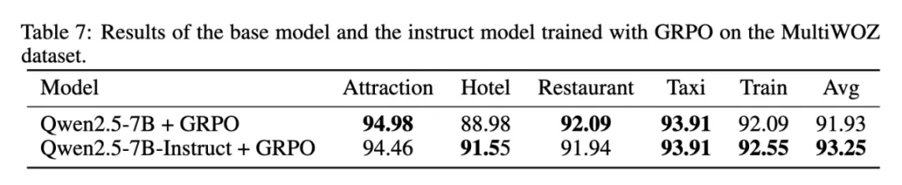

# 1. 资源

- 论文标题：Improving Generalization in Intent Detection: GRPO with Reward-Based Curriculum Sampling
- 论文链接：https://www.arxiv.org/abs/2504.13592

# 2. 问题

随着大模型（LLMs）的快速发展和可集成工具的爆炸增长，AI 智能助手在日常生活中可提供的便利越来越多，不仅包括传统任务型对话中订机票、查询天气等助理能力，还增加了无以计数的 AI 能力，如 AI 画图、解数学题、游戏攻略等。而 AI 智能助手准确理解用户的意图（Intent Detection）并路由至下游工具链是实现这些功能的第一步，其重要性不言而喻。

然而，工具的快速迭代、多样化、工具之间关系的复杂化也给意图识别带来新的挑战，即模型在应对新意图时普遍存在性能衰减问题。如何在开源的轻量级 LLMs 上训练泛化性更好、鲁棒性更强的意图识别模型，使得模型能够更准确理解未见场景的意图至关重要。

近日，腾讯 PCG 社交线的研究团队针对这一问题，采用强化学习（RL）训练方法，通过分组相对策略优化（Group Relative Policy Optimization, GRPO）算法，结合基于奖励的课程采样策略（Reward-based Curriculum Sampling, RCS），将其创新性地应用在意图识别任务上，显著提升模型在未知意图上的泛化能力，攻克了工具爆炸引发的意图泛化难题，推动大模型在意图识别任务上达到新高度。

# 3. 原理

基于强化学习的意图识别

该团队进行了大量实验，从不同维度深入剖析了 GRPO 算法在这一任务上的优势。该工作的贡献主要为以下四个方面：

1. 该团队证明了在意图检测问题上，通过强化学习（RL）训练的模型在泛化能力上显著优于通过监督微调（SFT）训练的模型，具体体现在对未见意图和跨语言能力的泛化性能大幅提升。值得一提的是除了完全新的未见意图，该工作还比较了对已知意图进行拆分、合并等实际产品场景会遇到的真实问题。

2. 该团队通过基于奖励的课程采样策略进一步增强了 GRPO 的训练效果，有效引导模型在训练过程中聚焦于更具挑战性的样例。

3. 在强化学习过程中引入思考（Thought），显著提升了模型在复杂意图检测任务中的泛化能力。这一发现表明，在更具挑战性的场景中，Thought 对于提升模型的泛化能力至关重要。

4. 该团队发现，在意图识别任务中，无论选择预训练模型（Pretrain）还是指令微（Instruct）调模型作为基础，经过相同轮次的 GRPO 训练后，两者性能相近。这一结果与传统训练经验有所不同。

## 4. 训练方法

**奖励函数**

**基于奖励的课程采样**

该团队采用课程学习的思路分两步对模型进行训练。

离线数据分类 该团队通过离线的方法对所有数据的难度进行了分类。具体过程中先进行一遍完整的 GRPO 方法，记录每

# 5. 实验

RL 能够帮助模型理解任务而不是模仿任务识别

实验设置：

- 数据集：该团队在 TODAssistant（自建中文数据集）和 MultiWOZ2.2（公开英文数据集）两个基准上开展评测。MultiWOZ2.2 数据集是公开的 TOD 任务数据集，该研究团队在该数据集上提取出了意图分类这个任务。
- 模型选取：该团队选取 Qwen2.5-7B-Instruct 模型作为基座模型，分别对于 SFT 方法和 GRPO 方法训练相同 epoch 来对比模型性能。
- 评测指标：用正确率评测意图分类的准确性。

GRPO 方法与 SFT 方法的对比：研究团队首先对比了 SFT 方法和 GRPO 方法。直接使用原始的 GRPO 方法，在意图识别任务上，模型可以达到与 SFT 相近的性能，在英文的 MultiWOZ2.2 数据集上做到了与 SFT 模型相同的表现，证明了 GRPO 方法在该任务上的有效性。

为了进一步探究 GRPO 的优势，研究团队针对模型的泛化性进行了评测。具体来说，在 MultiWOZ 数据集上，在训练过程中分别去掉测试集中的每个类别；在 TODAssistant 数据集上对原有的类别进行组合和细分操作，获得新的类别，来验证模型在该新类别上的准确性；该团队还测试了模型的跨语言能力（在英文数据集上训练后的模型在中文测试集上的结果）。实验结果表明，GRPO 方法相较于 SFT 方法，有着更好的泛化性能。

RCS 方法实验结果：在此基础上，研究团队进一步应用 RCS 方法进行实验。结果表明，在课程学习的第一阶段，模型收敛到与原始 GRPO 方法相近的准确率；在第二阶段难样例筛选过程后，模型的准确率进一步提升。

该团队在课程学习第二阶段的采样过程中，对于难样例与正常训练数据的比例进行了实验，随机在其他训练数据中采样与难样例混合共同训练。结果表明，单独训练难样例取得了最好的效果。

Thought 对于训练过程的影响：研究团队还探究了在意图识别这种逻辑较为简单的任务上 Thought 对于结果的影响。该团队发现，在这类任务上 Thought 同样有着关键的作用：在 TODAssistant 数据上，Thought 对于泛化能力的提升尤为重要；在 MultiWOZ2.2 数据集上，去掉 Thought 后模型的性能出现了大幅下降。

Pretrain 模型和 Instruct 模型在该任务上的区别：研究团队发现，在意图识别任务上，选取 Pretrain 模型或者 Instruct 模型作为底座，在经过相同的 epoch 进行 GRPO 训练后，可以收敛到相近的性能，这与传统的训练经验有所不同。

同时该团队还发现，instruct 模型在宽松格式和严格格式奖励函数下的生成长度均保持稳定。然而，Pretrain 模型在宽松格式奖励下生成长度先下降后上升，而严格格式奖励下则无此趋势。值得注意的是，这种长度增加并未提供有效信息。这一对比表明，类似 R1 的强化学习训练会诱导模型通过增加输出长度来获取更高奖励，但在相对简单的意图检测任务中，真正的 「顿悟时刻」 难以出现。

# 6. 未来展望

1. 在线数据筛选方法：现如今该团队的 RCS 数据筛选方法仍然是离线的，在后续的工作中将探索更高效的在线筛选方法。

2. 多意图识别：该研究团队针对意图识别的实验目前主要针对单意图场景，在后续工作中将继续探索多意图的识别。

3. 任务型对话相关任务扩展：目前该团队的实验都是在意图识别任务上进行，在未来的工作中将继续在更复杂的任务型对话相关任务上进行尝试。

# 参考

[1] 泛化性暴涨47%！首个意图检测奖励范式，AI工具爆炸时代意图识别新解法, https://mp.weixin.qq.com/s/ZxJj_Pgt9-u9dd4tGDJkIw
