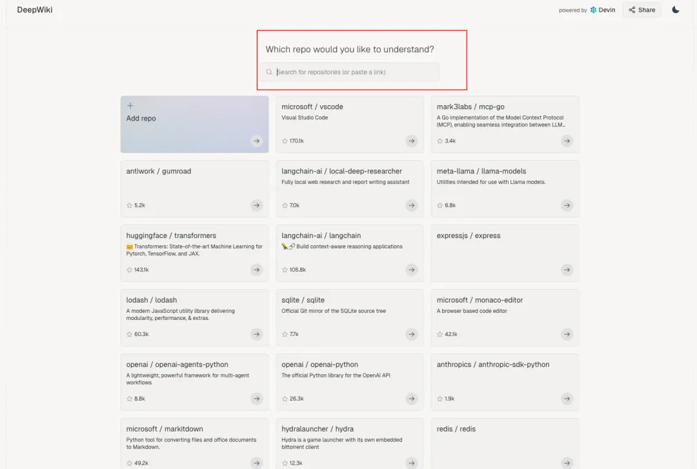
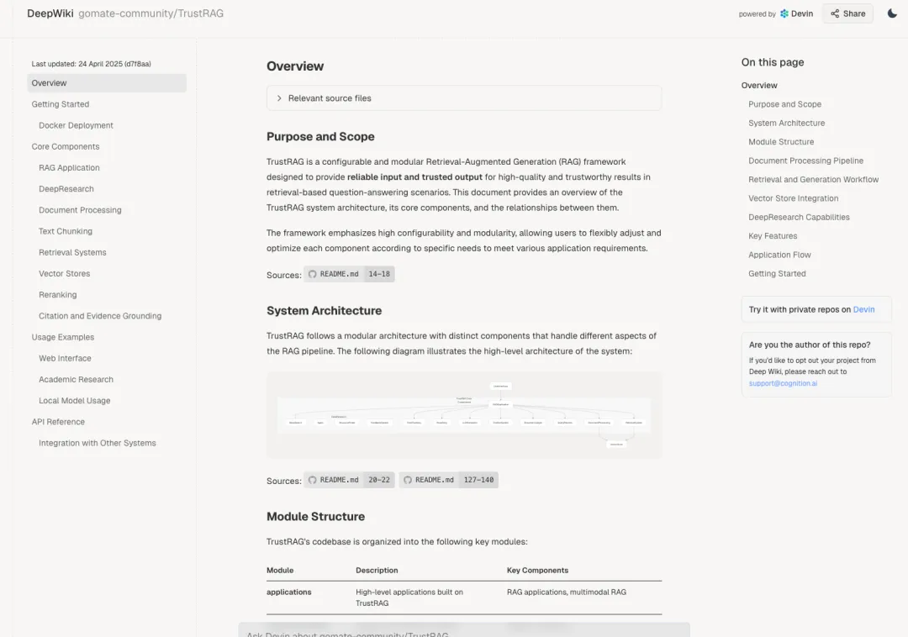

DeepWiki地址：https://deepwiki.com/

我们只需要将需要分析的Github地址粘贴到下面输入框即可：

之后会生成开源项目的DeepWiki页面，自动生成源码架构图和知识库：

# 参考

[1] DeepWiki：强烈建议每个程序员都用上，Github源码阅读神器！https://mp.weixin.qq.com/s/wUBdPQujcr6huyiFxLllAQ