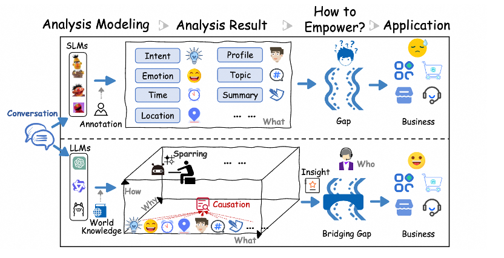
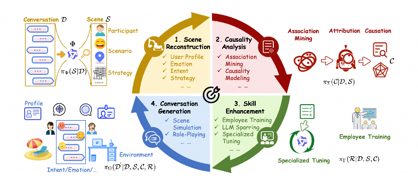
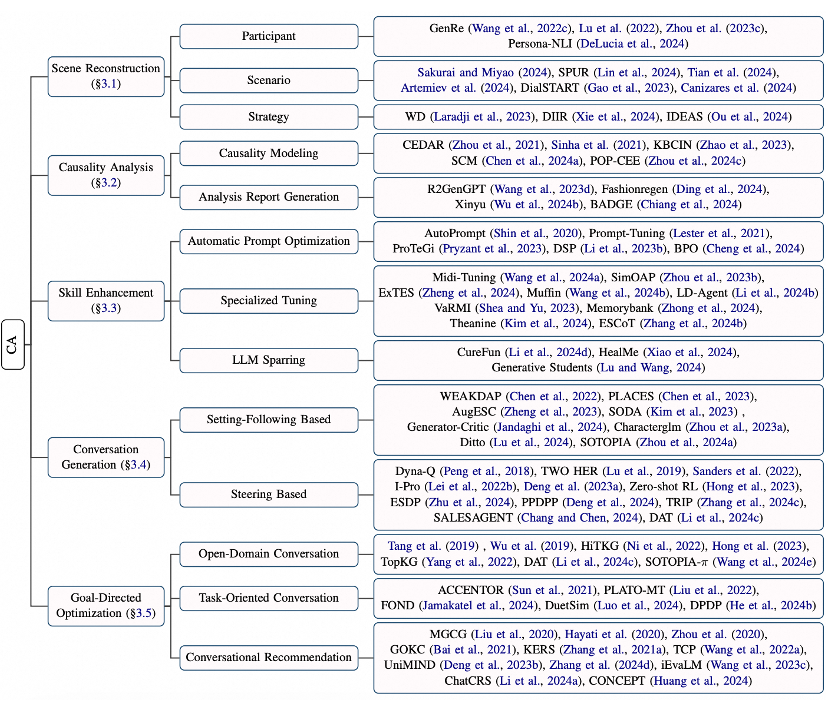
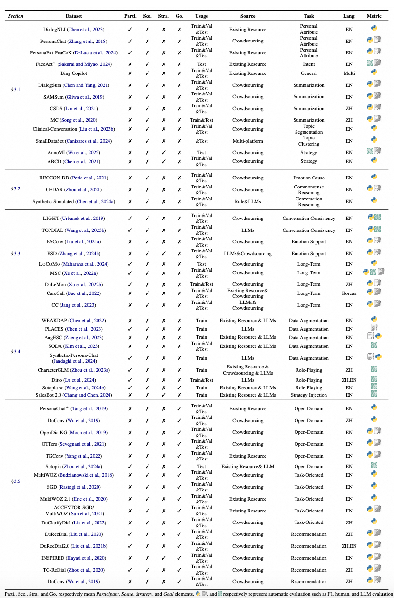

# 阿里会话分析综述论文

- The Imperative of Conversation Analysis in the Era of LLMs: A Survey of Tasks, Techniques, and Trends
- https://arxiv.org/abs/2409.14195
- 阿里，2024.9.21

小模型时代 vs. 大模型时代

小模型只能做到扁平、浅显的分析，如情感、意图分类；大模型由于其丰富的世界知识，其分析可以是多方面的、深层次的，使从 What 到 Why 再到 How 的全方位分析过程成为可能，更接近真实业务需求。但目前对话分析仍然面临严峻挑战：

- 定义：学术上没有系统的对话分析技术定义，导致对话分析的目标以及技术点相对分散。
- 数据：缺少包含完整对话要素的对话分析数据，导致难以精准建模、评测。
- 建模：区别于扁平的文本/文档，对话固有的多轮、语境依赖、隐含模糊性、口语化等性质，导致其需要更深层次的建模。
- 应用：大部分研究仍停留在浅层扁平的分析结果，如情感、立场、摘要等，与真实业务需求具有较大差距。

然而，目前并没有对话分析相关的技术性 survey 去整合归纳这些独立的研究，以及讨论大模型时代背景下的对话分析研究重点，从而难以真正形成技术合力来赋能商业应用。

话分析旨在从对话（如人人、人机、机器与机器以及多方对话）中挖掘关键信息，找出潜在原因，并制定解决方案以持续推动相关能力提升，从而更有效地实现商业目标，例如提升客户体验、降低投诉率。本文围绕对话分析的目标，将对话分析过程分为四个步骤：

1. 场景重建：任务旨在从对话内容中获取其中的场景要素，如对话的参与者、情景（如情感、意图、环境等），该过程以对话作为输入，重建其客观存在的要素。

2. 因果分析：任务寻求深入探究对话场景要素背后的线索，如对话参与者态度转变的原因，并从多通对话中进行归纳总结，该过程以对话和场景要素为输入，更精准地提炼出影响场景要素的因素。

3. 技能提升：任务力求根据归因结果朝着实现目标的方向优化整个系统；如果对话的参与者是人（例如客服），相关部门可以基于归因反馈进行针对性的培训；如果对话的参与者是 AI，算法专家基于归因结果进行模型基础能力的专项调优。该过程基于对话内容、场景要素以及归因结果进行建模，得到初步调优后的 insights（如场景要素设定、模型的长上下文遵循、情感支撑能力）。

4. 对话生成：任务旨在收集人在能力提升后产生的真实对话数据，或者 AI 基于调优的设定生成对话，如角色扮演技术，以为对话分析提供数据并检验目标的达成情况。

综合来看，场景重建是基础、因果分析是核心、技能提升是关键、对话生成是直观表现。同时，整个对话分析过程可以形式化为 Multi-Action RL 问题，State 为对话数据，Action 和 Policy 网络为场景重建、因果分析、技能提升一系列子 Action 及建模方法，对话生成为 Transition，Reward 围绕对话分析的整体目标计算（如提升用户满意度）。

# 参考

[1] 大模型时代的对话分析：阿里最新综述全面解析对话分析的必要性, https://www.53ai.com/news/LargeLanguageModel/2024103168297.html