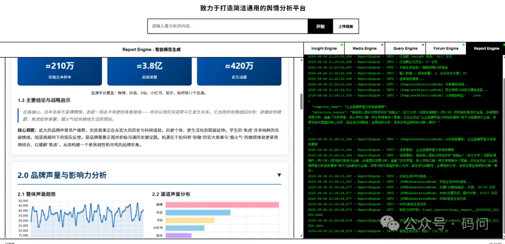

- Github (23.9k stars): https://github.com/666ghj/BettaFish

BettaFish 微舆：人人可用的多Agent舆情分析助手，打破信息茧房，还原舆情原貌，预测未来走向，辅助决策！从0实现，不依赖任何框架。

⚡ 项目概述
微舆：多智能体舆情分析系统，助您洞察全局，智见未来

“微舆”是一款从零构建的创新型多智能体舆情分析系统，致力于帮助用户打破信息茧房，还原事件原貌，预测发展趋势，为决策提供有力支持。用户只需像日常聊天一样提出分析需求，系统即可自动启动，覆盖国内外30+主流社交媒体平台，实时解析数百万条大众评论，让您轻松掌握舆情全貌。

“微舆”谐音“微鱼”，灵感来自斗鱼（Betta Fish）——体型虽小，却勇猛善斗、色彩绚丽，象征着“小而强大，无畏挑战”的精神。

除了高质量的分析报告，我们更具备🚀六大核心优势：

🔍 AI驱动的全域监控
AI爬虫集群7×24小时不间断运行，全面覆盖微博、小红书、抖音、快手等10余个国内外主流社交平台。不仅实时追踪热点，更能深入挖掘海量用户评论，还原最真实、最多元的大众声音。

🧠 超越大模型的复合分析引擎
系统不仅内置5类专业智能体，更融合微调模型与统计模型中间件，通过多模型协同分析，确保结果兼具深度、准确性与多维度视角。

🎬 强大的多模态解析能力
突破图文限制，支持抖音、快手等短视频内容的深度解析，同时精准提取天气、日历、股票等结构化多模态信息卡片，助您全面掌握舆情动态。

🗣️ 智能体“论坛”协作机制
每个智能体拥有专属工具与思维模式，通过“辩论主持人”模型引导链式思维碰撞与深度辩论，有效避免单一模型局限与同质化输出，激发更高质量的集体智慧。

🔗 公私域数据无缝融合
平台在分析公开舆情的同时，提供高安全性接口，支持将内部业务数据与舆情信息无缝整合，打破数据壁垒，实现“外部趋势+内部洞察”的深度融合。

⚙️ 轻量化高扩展性架构
基于纯Python模块化设计，实现轻量部署与一键启动。代码结构清晰，开发者可快速集成自定义模型与业务逻辑，轻松实现系统扩展与深度定制。

始于舆情，而不止于舆情。“微舆”的愿景，是成为驱动各类业务场景的简洁、通用、强大的数据分析引擎。

# 参考

[1] Star 23.9k 开源 AI 多Agent舆情分析助手 BettaFish, https://mp.weixin.qq.com/s/BBqq2KWcK_uf_12ByrOFHw