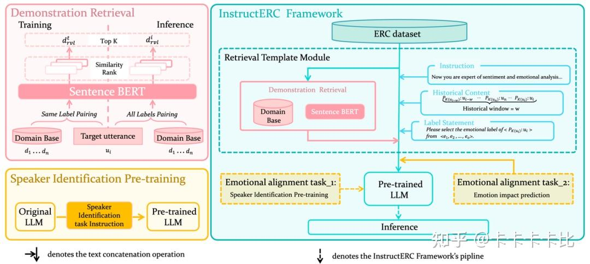

- https://github.com/LIN-SHANG/InstructERC
- https://arxiv.org/pdf/2309.11911

观察InstructERC总体概览图，主体部分为Retrieval Template Module和两个情感对齐任务，Retrieval Template Module，将传统的判别式框架的 ERC 模型转变为了与 LLM 结合的生成式的模型框架。ERC 任务强依赖于历史话语的情感分析 ，同时说话人在表达自己的情感倾向也着强烈的特点，可能是直抒胸臆，也可能反问，最后如果对话中存在多个人物（MELD，EmoryNLP），那么如何去考量对话之间的关系，当前的话语的情绪表达是针对哪句历史话语的回复等都需要被建模