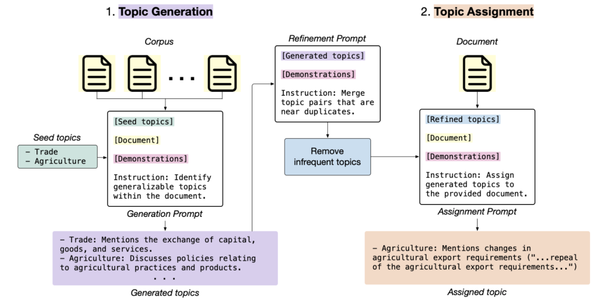
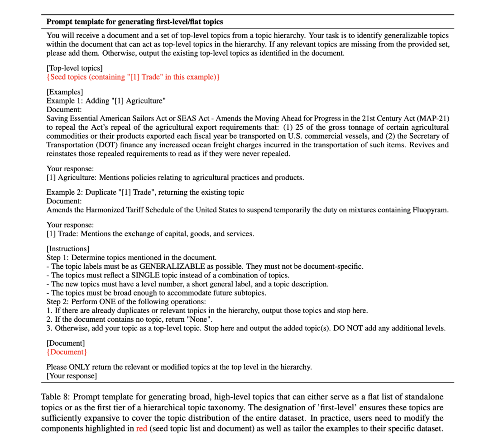
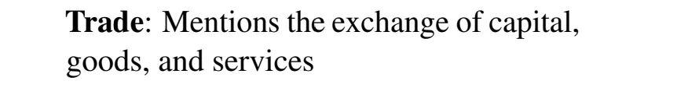
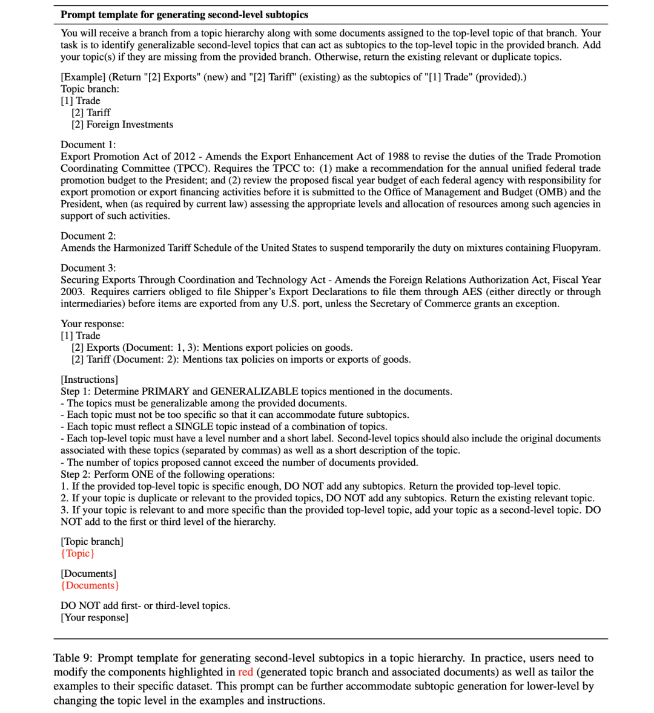
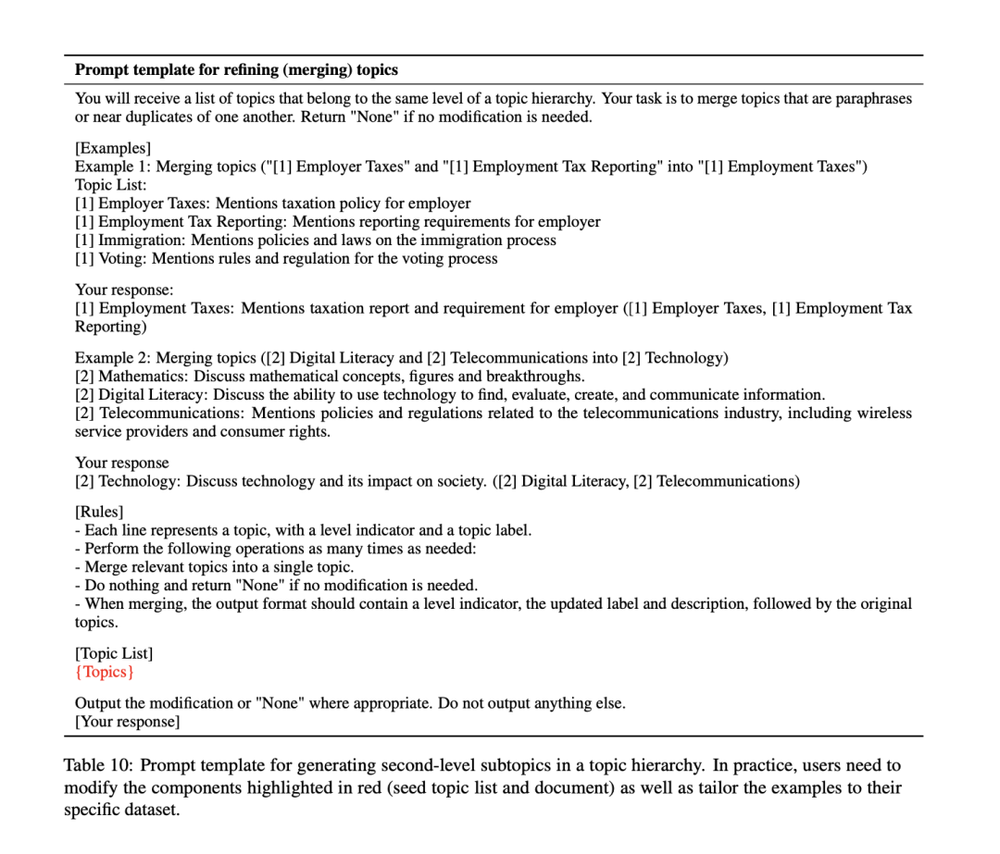
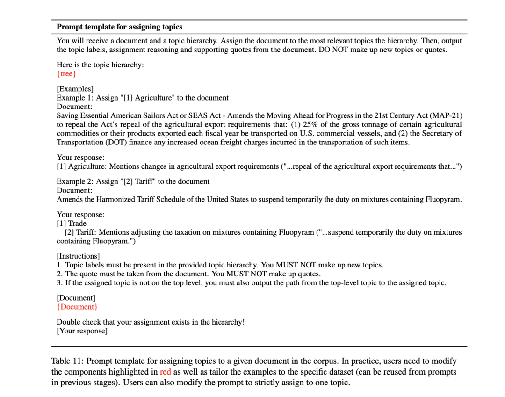
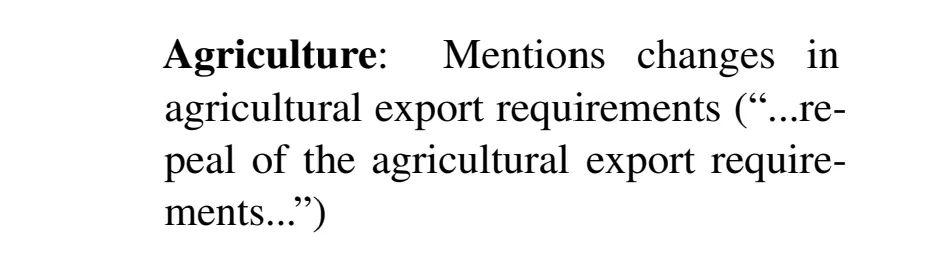
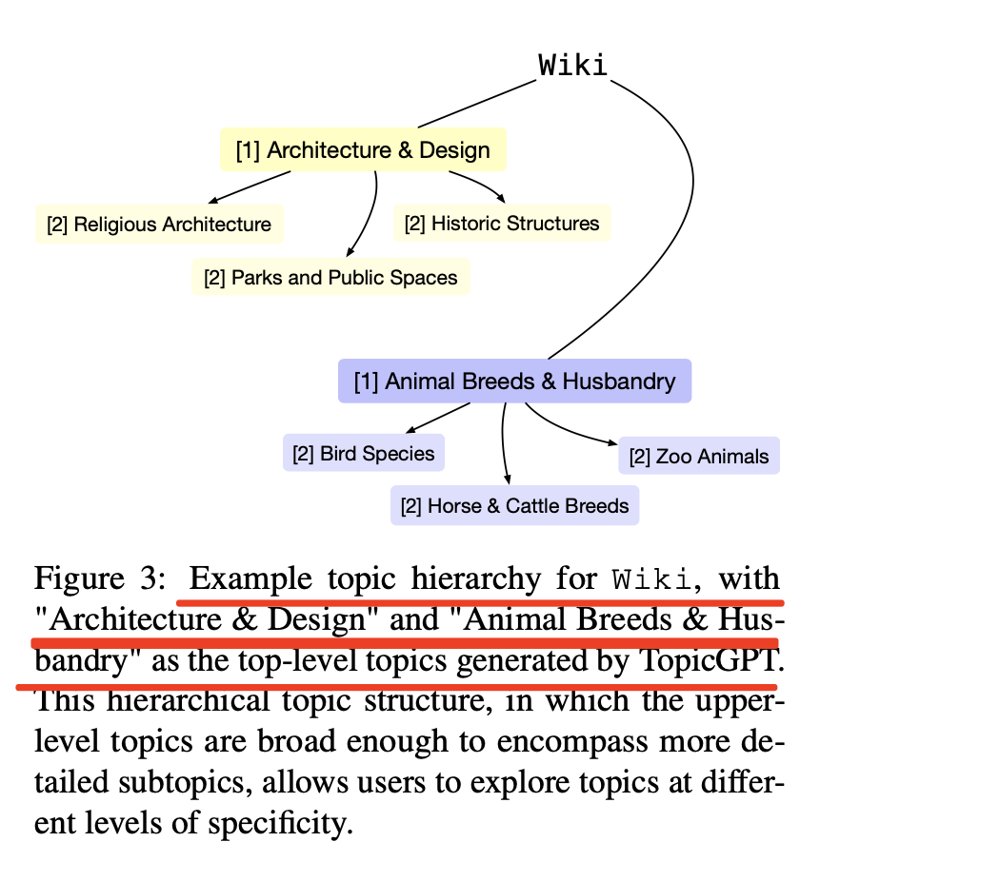
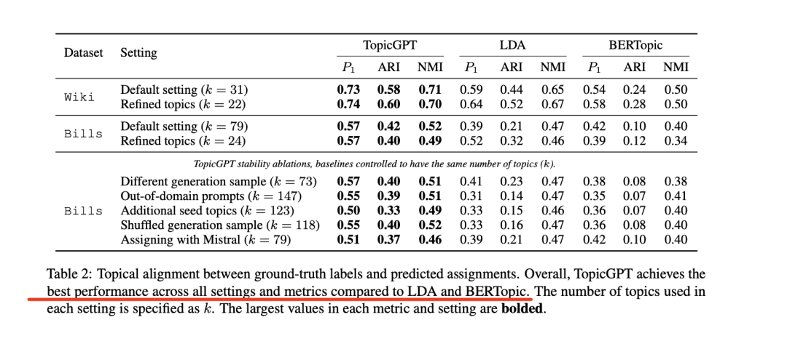

# 1. 资源

- Github： https://github.com/chtmp223/topicGPT
-《TopicGPT: A Prompt-based Topic Modeling Framework》(https://arxiv.org/abs/2311.01449)

# 2. 介绍

主题建模是在大量文本文档集合中发现潜在主题结构的常用技术。我们今天来谈谈这个话题。

传统的主题模型，如潜在Dirichlet分配（LDA），将文档表示为主题的混合体，其中每个主题都是单词的分布。主题通常用最可能的单词表示，但这种表示可能包含不连贯或不相关的单词，使用户难以解释主题。

虽然有些模型能让用户根据需求和领域知识交互式地引导主题，但它们的可用性受到词袋主题格式的限制。

为了解决这些局限性，TopicGPT依靠提示大型语言模型来执行上下文话题生成和分配。

为了解决这些问题，《TopicGPT: A Prompt-based Topic Modeling Framework》(https://arxiv.org/abs/2311.01449)引入了TopicGPT，使用LLM来发现所提供文本集合中的潜在主题。与其他方法相比，TopicGPT生成的主题更符合人类的分类。

首先，根据输入数据集中的文档样本和之前生成的主题列表，反复提示LLM生成新主题。

然后进一步完善生成的主题集，以整合冗余主题并消除不常见的主题。

最后，给定一个新文档，LLM会将其分配给一个或多个已生成的主题，并提供该文档的引文以支持其分配。 这些引文使该方法易于验证，解决了困扰传统主题模型的一些有效性问题。

与其他方法相比，TopicGPT生成的主题质量更高。在维基百科文章和国会法案两个数据集上，与LDA和BERTopic相比，TopicGPT的主题和赋值与人类标注的基本真实主题的一致性要高得多。

在三个外部聚类指标（单值平均纯度、归一化互信息和调整后的兰德指数）来衡量主题对齐度，发现Top-icGPT比基线有提高；

此外，它的主题与人类标记的主题在语义上更加对齐。进一步的分析表明，TopicGPT的主题质量在各种提示和数据设置下都很稳健。

# 3. 原理

TopicGPT包括两个主要阶段：主题生成（§3.1）和主题分配。

1、主题生成

主题生成阶段根据输入数据集提示LLM生成一组主题，然后进一步完善这些主题，删除不常用的主题并合并重复的主题。

这一步的输出可以选择性地输入到TopicGPT的分层扩展中，促使模型生成更精细的子主题。 

首先，生成新的主题：在第一阶段，反复提示大语言模型（LLM）生成描述性主题。

给定语料库中的一个文档d和一组种子主题S，该模型会被指示要么将d分配给S中的一个现有主题，要么生成一个能更好地描述d的新主题并将其添加到S中。

例如，具体的种子主题示例如下：

贸易：提及资本、商品和服务的交换 其中"贸易"是主题标签。

最初的种子集由少量人工撰写的主题组成（实验使用了两个种子主题），不需要特定于数据集。

其次，完善生成的主题：首先使用句子嵌入来识别余弦相似度≥0.5的主题对。然后，用五个这样的主题对提示LLM，指示它酌情合并相关或接近重复的主题对。

这一合并步骤可合并多余的主题，并调整各主题之间的特异性，从而返回一个连贯的最终列表。

为了解决上一步可能忽略的次要主题，剔除出现频率较低的主题。为此，跟踪每个主题的生成频率。如果某个话题的出现频率低于"剔除"阈值，就认为该话题是次要的，并将其从最终列表中剔除。

然后，生成话题层次结构：进一步利用TopicGPT来构建多层次的话题层次结构。

具体地，将细化阶段后生成的顶级话题视为顶级话题，并提示LLM在后续级别上生成更具体的子话题。

然后，向模型提供一个包含顶级主题t、种子子主题S′和与顶级主题t相关的文档dt的主题分支。

为了确保子主题是基于文档而不是幻觉，模型还必须返回支持每个子主题的具体文档。

如果文档无法在单个提示中找到，就会将它们划分到不同的提示中，并在随后的提示中包含由较早的提示生成的副标题。

2、主题分配

在分配阶段，目标是在生成的主题列表和数据集中的文档之间建立有效且可解释的关联。

首先，需要向LLM提供了生成的主题列表、2-3个示例和一份文档（有兴趣获取其中的主题）。然后，指示模型为给定的文档分配一个或多个主题。最终输出包括分配的主题标签、特定于文档的主题描述以及从文档中提取的引文，以支持这一分配。

引用文本提高了TopicGPT所做标记的可验证性，而这一直是LDA等传统方法所关注的问题。

主题任务示例如下：

农业：提及农产品出口要求的变化（"......农产品出口要求的提高......"）。其中"农业"是指定的主题标签，其后是主题描述和括号内的文件引文。 

其次，为了解决格式不正确或质量不高的主题分配问题，加入了自我修正步骤。具体地，使用一个解析器来识别幻觉主题分配或无效回复（如"无"/"错误"）。随后，向LLM提供被识别的文档和错误类型，打乱主题列表以增加随机性，并提示模型重新分配有效的主题。

# 参考

[1] 大模型遇上文本主题建模：TopicGPT基于提示的主题建模框架介绍, https://hub.baai.ac.cn/view/32387