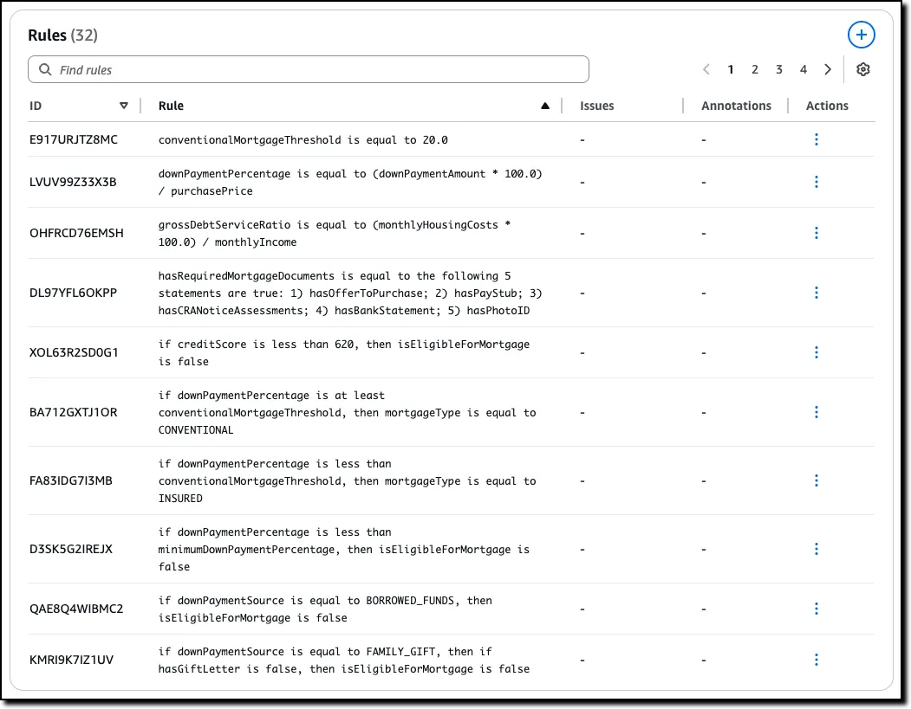
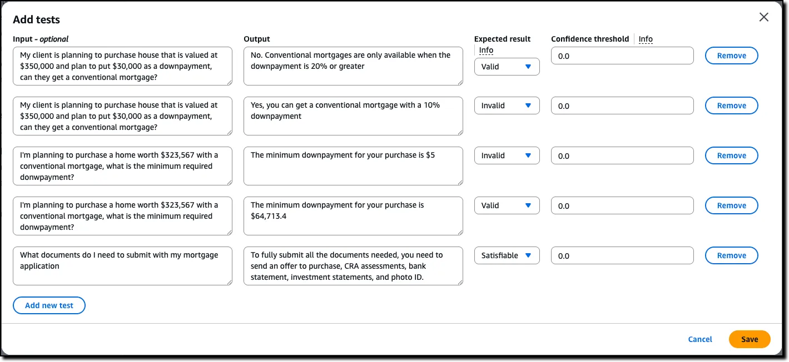

“一本正经地胡说八道”本来是一句网络用语，生成式AI出现后，这句话特别适合描述它的幻觉问题。对于企业来说，如果AI的回答无法确保准确性，谁都不敢轻易把它用于金融风控、医疗诊断或关键的客户服务等场景。

最近，亚马逊云科技把一套打磨了十余年的秘密武器拿了出来，宣布Amazon Bedrock Guardrails自动推理检查（Automated Reasoning checks）功能正式可用，提供了解决AI幻觉难题的新技术路径。

亚马逊云科技大中华区AI技术高级经理 郭韧介绍称，这是“大模型的逻辑监督员”。他将AI大模型幻觉分为两类，一类是语法和事实表达上的错误，一类则是输出的内容不符合业务逻辑，自动推理检查面向后者，解决大模型在业务逻辑校验上的问题。

要注意的是，目前它还无法在技术上彻底解决模型幻觉问题，但它在医疗健康、人力资源、运营团队、售后客服等讲究逻辑规则的垂直场景中，确实能基本解决模型“一本正经地胡说八道”的问题。

这套系统不像其他系统那样依赖于概率推理，通过为结果分配概率来处理不确定性，而是用数学和逻辑为AI的输出套上了一套“紧箍咒”，让他按照规则框架输出内容，它可以提供高达99%的验证准确率，几乎杜绝了违反既定规则逻辑的输出。

简简单单三步操作，就能为AI大模型套上“紧箍咒”

这套“紧箍咒”具体要如何为AI模型建立规则？然后让模型在输出的时候遵守这些规则呢？听起来感觉会比较麻烦，在沟通会的现场，郭韧通过简单的三步操作，清楚展示了主要过程。

第一步，准备好写满规则的原始文档；第二步，把文档上传到Amazon Bedrock Guardrails模块；第三步，系统会通过自动推理，把文档里的描述信息转化为一条条要遵守的规则。

整个过程中，用户无需编写任何代码，只需将一份已经有的，用自然语言写成的公司政策文档，比如电商平台的退换货政策或者HR部门休假规定文件或者银行按揭贷款规定文档上传到系统，系统会自动把文档里的转化为一系列规则和变量。

上图示例展示的是银行按揭贷款文档生成的规则，图片来自亚马逊云科技博客
以电商平台退换货规定为例，系统会自动抽取文档中的关键变量，如“产品类别”、“退货天数”等，并梳理出它们之间的规则。例如，一份简单的退货文档，系统就能自动提取出78条规则和81个变量。

虽然RAG技术也有助于缓解幻觉问题，但与这里的推理检查有明显不同。前者主要负责为大模型提供准确、相关的背景知识。而推理检查负责在推理的最后一步，验证大模型基于知识生成的回答是否严格遵守业务逻辑和规则。

郭韧介绍称，如果把规则文档丢给RAG系统，让RAG系统基于来提供规则约束力，这种做法不仅会消耗大量Token，成本会很高，而且模型能不能从大量内容里准确提取规则都会存疑，最后的效果会大打折扣。

评估校验和完善逻辑规则，让规则能用于业务生产环境

规则和变量初步创建成功后，还不能直接用于生产环境。接下来会对生成的规则进行评估、校验，过程中，业务专家可以对这些规则进行修改和修订，从而让规则更准确和完善。评估、校验大致是这样的：

系统首先会用AI自动生成各种各样的测试场景（省去了手动设计测试用例的麻烦），包含客户可能问的问题和模拟模型给的答案，业务专家先对测试用例进行判断，把它标记为有效（Valid）、无效（Invalid）或部分满足（Satisfiable）。

上图展示的测试用例，用户填写期望结果，然后进入验证流程，图片来自亚马逊云科技博客
比如，当用户询问：苹果产品的退换货政策是什么？

如果测试用例中回答，“苹果产品有15天退货期，5天内商品完好可退货”，则是完全符合规则的，人类专家会标记为有效（Valid）示例；

如果测试用例中回答，“苹果产品15天内可退货。“但缺少了“商品完好”这个条件，人类专家就会把它标记为部分满足（Satisfiable）的示例；

如果测试用例中回答说，“苹果产品30天内可退货。”那显然是违反规则的，人类专家就会把它标记为无效（Invalid）示例。

测试验证时，由套上了”紧箍咒“的AI模型对测试用例进行判断，如果判断结果跟人为判断是一致的，那这项测试就是通过了。如果发现不一致，专家可以通过自然语言反馈或直接编辑的方式，对规则进行微调，确保其与真实业务逻辑完全吻合。

整个过程中由于有大模型的辅助，它还可以给出完善规则的建议。比如，某产品支持七天以内退货，人类专家判断”退货天数为7天“是有效（Valid）示例，而系统会认为规则不充分，应该表述为在七天以内可退货。

通过这种人机协同的方式，策略的更新和迭代过程变得更可控、更可靠。把这套规则上线后，就成了业务模型的一套”紧箍咒“，实时审查AI在实际应用中的每一次输出，从而避免因业务幻觉带来的风险。

从赌概率到算出来的确定性，AI进入可验证的阶段

当一些AI安全工具还在靠不确定的概率和经验时，Amazon Bedrock Guardrails的自动推理检查功能提供了可被证明的信任，是具有确定性的安全保障，这对于金融、能源、医疗等高度监管的行业至关重要。

亚马逊云科技携手普华永道（PwC）打造了一套面向公用事业的停电管理优化系统。该方案通过自动推理检查技术，对AI生成的应急响应流程进行逻辑校验和优化，确保处理步骤既符合法规，又具备可操作性。

普华永道全球及美国商业技术与创新官Matt Wood表示：“我们与亚马逊云科技在自动推理检查方面的合作，堪称负责任的AI领域的重大突破。我们十分荣幸成为亚马逊云科技该项创新成果的首发合作伙伴，未来还会将这一创新成果推广至制药、公用事业、云合规等各个领域。”

郭韧介绍称，这里用的自动推理并非新的技术概念，它背后的符号式AI（Symbolic AI）是人工智能最早期的分支之一，其核心思想就是将世界知识转化为逻辑符号，通过严谨的推理来确保结论的正确性。

“过去十多年，亚马逊云科技早已将自动推理技术大规模应用于Amazon S3、Amazon IAM等核心服务的权限校验与安全验证中，”郭韧在技术分享会上介绍，“它一直是保障云服务安全可靠的幕后基石。”

这些在背后经过多年打磨的经验，现在通过Amazon Bedrock Guardrails直接开放给客户。这意味着，企业不再需要从零开始构建复杂的逻辑校验系统，而是可以直接将亚马逊云科技十年打磨的工具，快速构建AI安全与合规能力，让AI更靠近生产力。

目前，Amazon Bedrock Guardrails 中的自动推理检查现已在以下区域全面推出：美国东部（俄亥俄州、弗吉尼亚州北部）、美国西部（俄勒冈州）和欧洲（法兰克福、爱尔兰、巴黎）。

# 参考

[1] 亚马逊云科技打造了一套“紧箍咒”，让AI按照业务逻辑规则说话亚马逊云科技打造了一套“紧箍咒”，让AI按照业务逻辑规则说话, https://www.doit.com.cn/p/541848.html