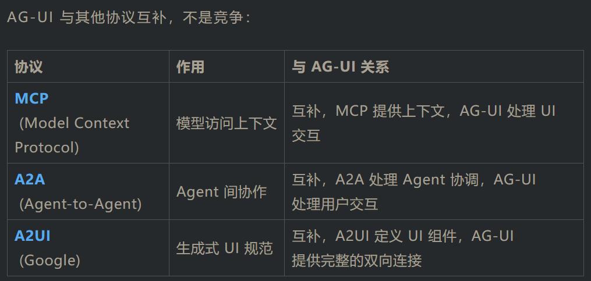

相关链接：

• 官方网站：https://www.copilotkit.ai/
• GitHub 仓库：https://github.com/CopilotKit/CopilotKit
• 文档：https://docs.copilotkit.ai/
• AG-UI 协议：https://docs.ag-ui.com/
• Discord 社区：https://discord.gg/copilotkit
• Copilot Cloud：https://cloud.copilotkit.ai/

---

一、解决了什么问题？
1. AI Agent 难以融入应用
当前的 AI 开发生态主要聚焦后端：

• LangChain、LangGraph 构建 Agent 推理流程
• CrewAI 编排多 Agent 协作
• OpenAI、Claude API 提供强大的 LLM 能力
但这些工具都缺少一个关键环节：如何将 Agent 优雅地集成到用户界面中？

开发者面临的挑战：

• 实时流式输出：LLM 生成的 token 需要实时显示，而不是等待完整响应
• 工具调用可视化：Agent 调用 API、执行代码时，用户需要看到进度
• 人机协作：用户要能审批 Agent 的操作、修改共享状态
• 状态同步：Agent 生成的计划、表格需要增量更新，不能每次都传输完整数据
• 多 Agent 协调：不同 Agent 之间需要协作，UI 要统一管理
结果是：开发者要为每个 Agent 项目写大量自定义的 WebSocket、SSE、状态管理代码。这不仅耗时，而且容易出错。

2. 缺乏统一的 Agent-UI 协议
更严重的问题是，每个 Agent 框架都有自己的通信方式：

• LangGraph 用一套格式
• CrewAI 用另一套
• 自定义 Agent 又是一套
前端开发者需要为每种 Agent 框架写不同的集成代码，无法复用。这就像每个品牌的充电器都不兼容一样痛苦。

3. CopilotKit 的解决方案
CopilotKit 提供了完整的解决方案：

🎯 统一协议层 - AG-UI Protocol

CopilotKit 创建并推动了 AG-UI（Agent-User Interaction Protocol）这个开放标准，定义了 Agent 和 UI 之间的通信规范。就像 HTTP 统一了网络通信，AG-UI 统一了 Agent-UI 通信。

⚛️ React 组件库

提供开箱即用的 UI 组件和 Hooks：

• useAgent - 连接任何 AG-UI 兼容的 Agent
• CopilotChat - 完整的聊天界面
• CopilotSidebar、CopilotPopup - 侧边栏、弹窗形式
• Headless UI - 完全自定义的无头组件

---

CopilotKit 的一个重要贡献是推动了 AG-UI Protocol 成为行业标准。

协议愿景
就像 HTTP 统一了 Web 通信，AG-UI 要统一 Agent-UI 通信：

• 任何 Agent 框架都可以发出 AG-UI 事件
• 任何 UI 框架都可以消费 AG-UI 事件
• 组件可互换、可复用
生态系统采纳
AG-UI 已被多个主流框架采纳：

官方支持：

• Microsoft Agent Framework
• LangGraph
• CrewAI
• Pydantic AI
社区集成：

• AWS Strands（刚宣布集成）
• Agno
• Mastra
• LlamaIndex
多语言 SDK：

• TypeScript（官方）
• Python（官方）
• Kotlin
• Go
• Java
• Rust
与其他协议的关系

