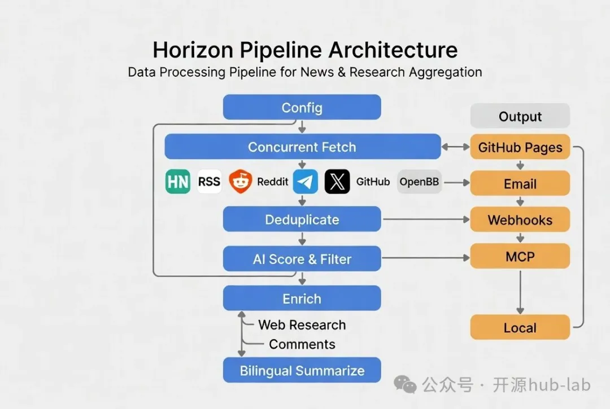

Horizon 不止是另一个AI总结器
Horizon（Thysrael/Horizon）是一个开源的AI驱动新闻雷达系统，主要用Python开发（占比99.6%），采用MIT许可。能从用户自定义的多源头实时抓取内容，包括Hacker News、RSS/Atom订阅、Reddit、Telegram公共频道、Twitter/X、GitHub用户事件或仓库发布、OpenBB金融新闻等。系统会进行跨平台去重、AI打分（0-10分）、过滤、网页研究富化背景知识、社区评论总结，最终生成结构化的中英双语Markdown每日简报，并支持多种交付渠道。

项目核心理念是“保留人类品味”：AI负责降噪和富化，但用户可完全自定义来源、阈值、模型、语言和输出方式。不是简单的内容聚合器，而是构建“专属新闻雷达”的完整流水线。

核心功能点：

● 多源实时抓取与并发处理：支持Hacker News（top stories + top评论）、任意RSS/Atom、Reddit（subreddit/user + top评论）、Telegram公共频道、Twitter/X（需Apify）、GitHub（user events或repo releases）、OpenBB金融新闻watchlist。
AI驱动打分与过滤：使用Claude、GPT系列、Gemini、DeepSeek、Doubao、MiniMax、Ollama或任意OpenAI兼容API，对每条内容打0-10分，根据ai_score_threshold过滤，仅保留高价值项。

●跨平台去重：合并相同故事/URL的重复内容，避免简报冗余。

●富化与上下文增强：对高分项进行网页搜索（DuckDuckGo）提取1-3个技术概念，提供背景解释；同时收集并AI总结社区讨论（HN、Reddit、Twitter评论）。

●双语结构化简报生成：从同一批来源自动生成英文和中文Markdown，包括Highlights、详细总结、标签、引用、社区讨论等部分。

●多渠道交付：

○GitHub Pages：自动发布到docs/生成每日站点（支持Actions自动化）。

○Email：自托管SMTP/IMAP，支持订阅/退订管理。

○Webhook：推送至飞书（Lark）、钉钉、Slack、Discord等自定义端点。

○MCP Server：暴露流水线为工具和只读资源，供AI助手/Agent调用。

○本地文件输出。

●交互式向导：horizon-wizard根据用户兴趣自动生成data/config.json。

●高度可配置：JSON配置支持环境变量插值${VAR_NAME}，支持throttle、concurrency、自定义prompt等高级调优。

●扩展性：所有scraper继承BaseScraper，易于新增来源。

参考：https://mp.weixin.qq.com/s/ElTJbHV4Pyh9hUvfXuec6g
