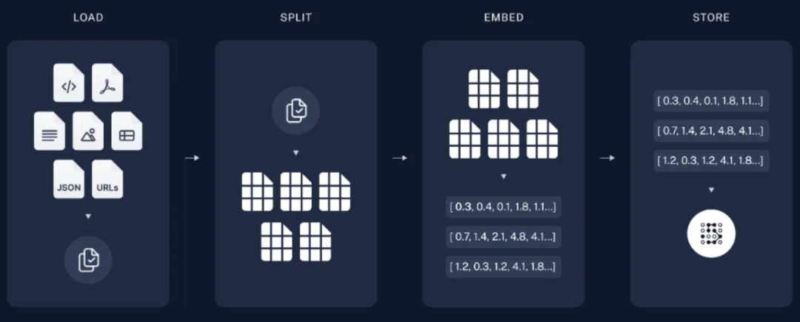

# 0. 介绍

# 1. LLM

# 2. RAG

RAG（Retrieval-Augmented Generation）技术是一种集成检索与生成双重能力的知识增强方案，旨在应对复杂多变的信息查询和生成挑战。在如今的大模型时代背景下，RAG 巧妙地引入外部数据源，比如：本地知识库或企业信息库，为 AI 大模型赋予了更强大的检索和生成实力，从而显著提升了信息查询和生成的品质。

RAG 技术的核心在于它将先进的向量数据库与大模型的智能问答能力进行了完美结合。知识库中的信息被精心存储在向量数据库中，当接收到用户的问题时，系统能够迅速从知识库中检索出相关的知识片段。随后，这些片段会与大模型的智慧相结合，共同孕育出精确而全面的回答。这种技术的运用极大地提高了 AI 系统在处理复杂问题时的准确性和响应速度，为用户带来了更加优质和高效的体验。
总之，RAG 技术就是给大语言模型新知识。

# 3. Agent

在 AI 大模型时代，任何具备独立思考能力并能与环境进行交互的实体，都可以被抽象地描述为智能体（Agent）。这个英文词汇在 AI 领域被普遍采纳，用以指代那些能够自主活动的软件或硬件实体。在国内，我们习惯将其译为“智能体”，尽管过去也曾出现过“代理”、“代理者”或“智能主体”等译法。
智能体构建在大语言模型的推理能力基础上，对大语言模型的 Planning 规划的方案使用工具执行（Action） ,并对执行的过程进行观测（Observation）,保证任务的落地执行。

总之，Agent 智能体 = 大语言模型的推理能力 + 使用工具行动的能力。

# 4. MCP（Model Context Protocol）

MCP（模型上下文协议）是由 Anthropic 定义的一个开放协议，标准化应用程序如何为大语言模型（LLM）提供上下文。更具体地说，它试图标准化基于 LLM 的应用程序与其他环境集成的协议。

在 AI Agent 系统（Agentic Systems）中，上下文可以通过多种方式提供：

1. 外部数据：这是长期记忆的一部分。
2. 工具：系统与环境交互的能力。
3. 动态提示词：可以作为系统提示词（System Prompt）的一部分注入。

第一、为什么要标准化？

目前，AI Agent 应用的开发流程很混乱： 
1. 有许多 AI Agent 框架存在细微差异。虽然看到生态系统蓬勃发展令人鼓舞，但这些细微差异很少能带来足够的价值，但可能会显著改变你的代码编写方式。
2. 与外部数据源的集成通常是临时实现的，并且使用不同的协议，即使在组织内部也是如此。对于不同公司来说，这显然是如此。
3. 工具在代码库中以略微不同的方式定义。如何将工具附加到增强型 LLM 上也是不同的。

目标是提高我们创新 AI Agent 应用的速度、安全性以及将相关数据带入上下文的便利性。

第二、MCP 架构设计

1. MCP Host：使用 LLM 为核心并希望通过 MCP 访问数据的程序。 
2. MCP Client：与 MCP Server 保持1:1连接的客户端。
3. MCP Server：每个 MCP Server 都通过标准化的模型上下文协议公开特定功能的轻量级程序。
4. Local Data Sources：你计算机上的文件、数据库和服务，MCP Server 可以安全访问。
5. Remote Data Sources：通过互联网可用的外部系统（比如：通过 API），MCP Server 可以连接到这些系统。

**核心功能**

1. 上下文数据注入

   MCP允许将外部资源（如文件、数据库记录或API响应）直接注入到提示词或工作内存中。所有数据均通过标准化接口传输，使LLM能够保持轻量化与整洁性。

2. 函数路由与调用
   
   该协议支持模型动态调用工具。开发者可注册诸如searchCustomerData（查询客户数据）或generateReport（生成报告）等能力，LLM即可按需调用。这相当于为AI配备了一个可插拔工具箱，而无需将工具硬编码到模型内部。

3. 提示词编排

   MCP能智能组装关键上下文，而非将所有细节塞入提示词。这种模块化实时构建方式，实现了：

4. 更精准的上下文选择
5. 更少的token消耗
6. 更优质的输出结果

**实现特性**
- 基于HTTP(S)协议运行，使用JSON格式的能力描述符
- 模型无关设计-任何具备兼容运行时的LLM均可接入符合MCP标准的服务端
- 兼容企业级认证标准（如OAuth2、mTLS）及API网关

工程应用场景
1. LLM与企业内部API集成
   通过MCP实现对企业结构化业务数据的安全访问（只读或交互式），避免直接暴露原始API端点
2. 企业级智能体赋能
    为自主智能体动态注入运行时上下文，支持从Salesforce、SAP或内部知识库等工具实时获取信息
3. 动态提示词构建
   根据用户会话状态、系统运行状态或任务管道逻辑，智能定制提示词内容

# 5. Function Calling

Function Calling 是由 OpenAI 等公司推动的一种技术，它允许大语言模型（LLM）通过自然语言指令与外部工具和服务进行交互，从而将自然语言转换为具体的 API 调用。这一技术解决了大语言模型在训练完成后知识更新停滞的问题，使大模型能够获取实时信息，比如：当前的天气、股市收盘点数等。

第一、工作原理

Function Calling 的工作原理可以通过以下4个步骤来理解：

1. 识别需求：大模型识别出用户的问题需要调用外部 API 来获取实时信息。比如：用户询问“今天北京的天气如何？”大模型会识别出这是一个关于实时天气的问题。
2. 选择函数：大模型从可用的函数库中选择合适的函数。在这个例子中，大模型会选择 get_current_weather 函数。
3. 准备参数：大模型准备调用函数所需的参数。例如：{  "location": "北京",  "unit": "celsius"}
4. 调用函数：AI 应用使用这些参数调用实际的天气 API，获取北京的实时天气数据。
5. 整合回答：大模型将获取的数据整合成一个完整的回答，比如：“根据最新数据，北京今天的天气晴朗，当前温度23°C，湿度45%，微风。今天的最高温度预计为26°C，最低温度为18°C。”

第二、对开发者的好处

对于开发者来说，使用 LLM 的 Function Calling 入门相对容易。开发者只需按照 API 的要求定义函数规格（通常是 JSON 格式），并将其随 Prompt 请求发送给大模型。大模型会根据需要调用这些函数，整个逻辑相当直观。因此，对于单一大模型、少量功能的简单应用，Function Calling 的实现非常直接，几乎可以“一键”将大模型输出对接到代码逻辑中。

第三、局限性

然而，Function Calling 也有一些局限性：
- 缺乏跨大模型的一致性：每个 LLM 供应商的接口格式略有差异，这使得开发者在支持多个大模型时需要为不同的 API 做适配，或者使用额外的框架来处理这些差异。
- 平台依赖性：Function Calling 通常依赖于特定的平台或框架，这限制了其在不同环境中的通用性。
- 扩展性有限：虽然 Function Calling 能够解决特定问题，但在面对更复杂的任务时，其扩展性可能会受到限制。开发者可能需要为每个新功能编写新的函数，并确保这些函数与模型的交互逻辑兼容。

第四、总结

Function Calling 是一种强大的工具，它为大语言模型提供了与外部工具和服务交互的能力，从而解决了大模型知识更新停滞的问题。然而，它的局限性在于缺乏跨模型的一致性和平台依赖性。尽管如此，Function Calling 仍然是一个重要的技术，尤其是在需要快速实现特定功能时。未来，随着技术的不断发展，我们期待看到更多能够克服这些局限性的解决方案。

# 6. 知识库

对于企业而言，构建一个符合自身业务需求的知识库是至关重要的。通过RAG、微调等技术手段，我们可以将通用的大模型转变为对特定行业有着深度理解的“行业专家”，从而更好地服务于企业的具体业务需求。这样的知识库基本上适用于每个公司各行各业，包括：市场调研知识库、人力资源知识库、项目管理知识库、技术文档知识库、项目流程知识库、招标投标知识库等等。

知识库的技术架构分为两部分：

第一、离线的知识数据向量化

加载：通过文档加载器（Document Loaders）加载数据/知识库。

拆分：文本拆分器将大型文档拆分为较小的块。便于向量或和后续检索。

向量：对拆分的数据块，进行 Embedding 向量化处理。

存储：将向量化的数据块存储到向量数据库 VectorDB 中，方便进行搜索。

第二、在线的知识检索返回

检索：根据用户输入，使用检索器从存储中检索相关的 Chunk。

生成：使用包含问题和检索到的知识提示词，交给大语言模型生成答案。

# 7. 向量数据库

向量数据库是专注于存储和查询向量的系统，其向量源于文本、语音、图像等数据的向量化表示。

相较于传统数据库，向量数据库更擅长处理非结构化数据，比如：文本、图像和音频。在机器学习和深度学习中，数据通常以向量形式存在。

向量数据库凭借高效存储、索引和搜索高维数据点的能力，在处理比如：数值特征、文本或图像嵌入等复杂数据时表现出色。

总之，知识库的存储载体往往是向量数据库，另外在数据存储和检索上，向量数据库以向量空间模型高效存储和检索高维数据，为 AI 大模型和 Agent 智能体提供强有力的数据支持。

# 8. 知识图谱

知识图谱是一种基于实体和关系的图结构数据库，旨在表示和管理知识。它采用结构化数据模型来存储、管理和显示人类语言知识。

知识图谱通过语义抽取建立人类语言知识间的关系，形成树状结构。实体如人、地点、组织等，具有特定属性和关系，这些关系连接着不同的实体。通过数据挖掘、信息处理和图形绘制，知识图谱揭示了知识领域的动态发展规律，为学科研究提供了有价值的参考。

医疗领域是知识图谱技术的一个广泛应用场景，它可以帮助临床诊疗、医疗数据的整合与利用，并通过实体识别、关系抽取和数据集训练，以图谱形式展示关键节点和它们之间的联系，从而支持更精准的医疗决策。

与此同时，在智能推荐、自然语言处理、机器学习等领域也具有广泛的应用。尤其在搜索引擎领域，它能够提高搜索的准确性，为用户提供更加精准的搜索结果。

总之，知识图谱本质上是一种叫作语义网络的知识库，即一个具有有向图结构的知识库，其中图的结点代表实体或者概念，而图的边代表实体/概念之间的各种语义关系。

# 9. AGI

AGI（通用人工智能）作为 AI 发展的终极愿景，追求的是让智能系统具备像人类一样理解和处理各种复杂情况与任务的能力。在实现这一宏伟目标的过程中，AI 大模型、Prompt Engineering、Agent 智能体、知识库、向量数据库、RAG 以及知识图谱等技术扮演着至关重要的角色。这些技术元素在多样化的形态中相互协作，共同推动 AI 技术持续向前发展，为实现 AGI 的最终目标奠定坚实基础。

为了帮助同学们彻底掌握 AI 大模型 Agent 智能体、知识库、向量数据库、 RAG、微调私有大模型的应用开发、部署、生产化，我会开场直播和同学们深度剖析，请同学们点击以下预约按钮免费预约。

# 参考

[1] 一文剖析大模型、RAG、Agent、MCP、Function Calling、知识库、向量数据库、知识图谱、AGI 的区别和联系，https://mp.weixin.qq.com/s/80zFbe2D-Z3-nC33jxtgFA