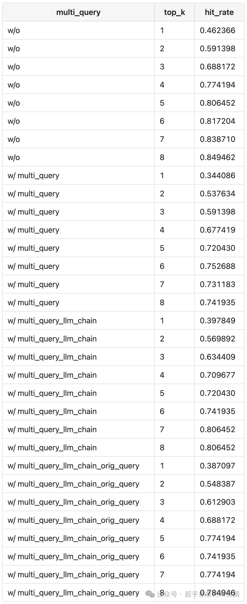
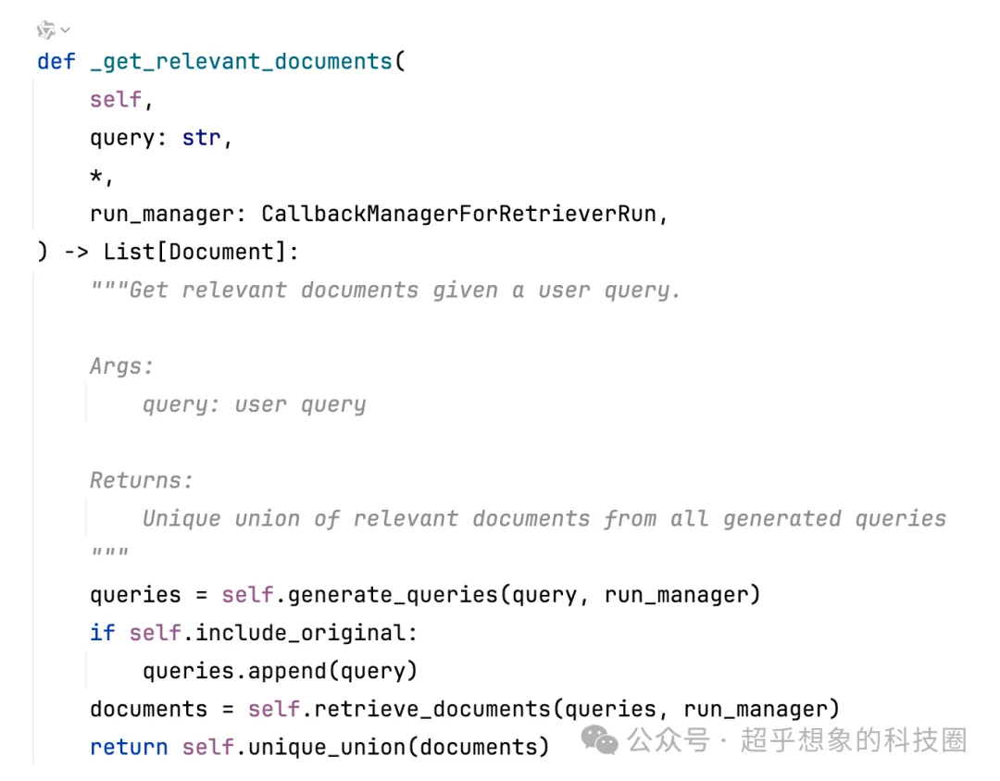
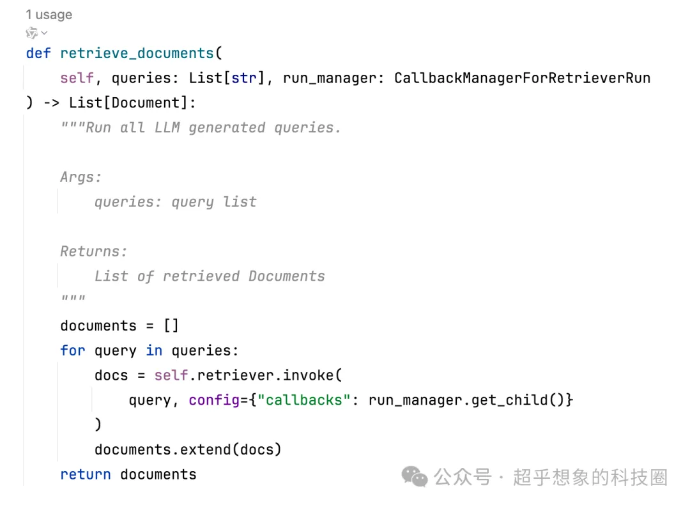
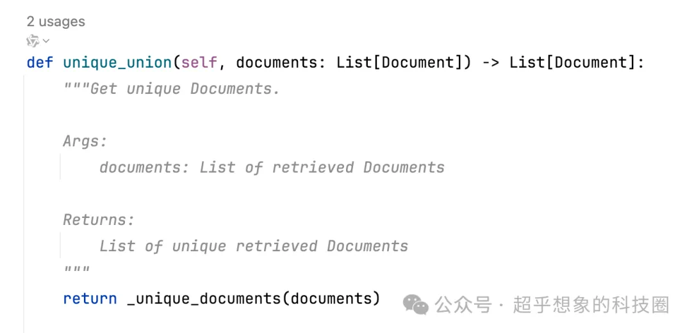
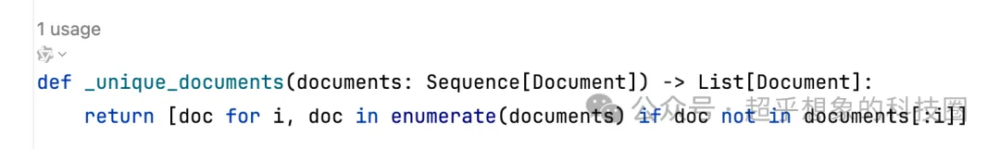

# 1. 简介

参考：
- 微信文章：https://mp.weixin.qq.com/s/NCsxMqkAQEGSLCxDXU_mkA
- Github (7 stars): https://github.com/Steven-Luo/MasteringRAG


# 2. 方法
```python
from langchain_community.chat_models import ChatOllama

from langchain.prompts import PromptTemplate
import re

llm = ChatOllama(base_url='http://localhost:11434', model='qwen2:7b-instruct')

def get_query_gen_chain(n_sim_queries):
    prompt = PromptTemplate(
        input_variables=['question', 'n_sim_queries'],
        template = """你是一个AI语言模型助手。你的任务是基于给定的原始问题，再生成出来最相似的{n_sim_queries}个不同的版本。\
    你的目标是通过生成用户问题不同视角的版本，帮助用户克服基于距离做相似性查找的局限性。\
    使用换行符来提供这些不同的问题，使用换行符来切分不同的问题，不要包含数字序号，仅返回结果即可，不要添加任何其他描述性文本。
    原始问题：{question}
    """
    )
    queries_gen_chain = (
        prompt.partial(n_sim_queries=n_sim_queries)
        | llm
        # 有时候模型不遵循指令，把前面的序号、- 去掉
        | (lambda x: [
            re.sub(r'(^\-\s+)|(^\d+\.\s)', '', item.strip()) 
            for item in x.content.split('\n') if item.strip() != ''
        ])
    )
    return queries_gen_chain


```

整合到检索器中

```python
etriever = MultiQueryRetriever(
    retriever=vector_db.as_retriever(search_kwargs={'k': k}), llm_chain=queries_gen_chain
)
```

需要注意的是，默认构造的检索器，只会拿生成的相似问题检索文档片段，而不会使用原始的query，这在有些情况下是会影响效果的，Langchain提供了一个include_original的参数，只需要在构造MultiQueryRetriever时传递并赋值为True即可，或者设置retriever.include_original = True

# 3. 测试

检索性能对比

检索器性能依旧采用之前的评估方法，评估Top1~8的命中率，下表中：

w/o：不使用MultiQuery

w/ multi_query：使用从LLM构建的MultiQuery检索器

w/ multi_query_llm_chain：使用从llm_chain构建的MultiQuery检索器

w/ multi_query_llm_chain_orig_query：使用从llm_chain构建的MultiQuery检索器，并开启include_original=True



# 4. 深入

细探MultiQuery检索过程

从检索结果可以看出，使用MultiQuery的检索器，在我们这个文档检索任务中，Top1~8的命中率全都是不如基础流程的，下面简单分析一下原因：

检查Langchain的源代码（langchain/langchain/retrievers/multi_query.py），可以发现，检索的流程是：

- 调用generate_queries方法，生成相似问题
- 如果开启了include_original=True，将原query加到末尾
- 对每个query依次检索
- 去重合并



依次检索的逻辑



去重的逻辑





可以看出，去重就“只是”进行了去重，没有做任何额外的排序，而考虑到加入documents的顺序，先是相似问题，最后才（可能，取决与是否配置include_original=True）包含原始query，这就导致，如果LLM生成的相似问题，本身与原始问题差异比较大，那它检索到的k个文档片段，反而不是原始query的，而去重的过程，导致结果的文档片段，是按照相似问题、原始问题（可能有）的检索结果顺序添加的，如果基础检索器已经设置为检索k个知识片段，MultiQuery合并后依然设置为k个，那其实是相当于每次都用了生成的第一个相似问题的检索结果。
