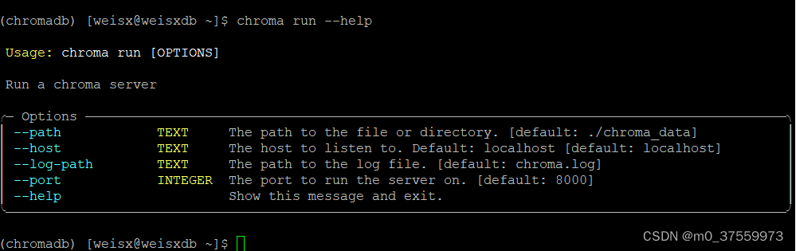

# 1. 安装

chromadb简单易集成，适合小型或快速实验项目。安装chromadb库：

```bash
pip install chromadb
```

# 2. 命令行启动

方法1：可直接在python代码中创建调用向量库，使用方法见其它结合langchain的介绍文档

方法2：启动服务端，在客户端通过调用

```shell
chroma run --help
```



启动服务端

```shell
chroma run --host 0.0.0.0
```

# 3. 客户端连接

详见langchain部分的使用
