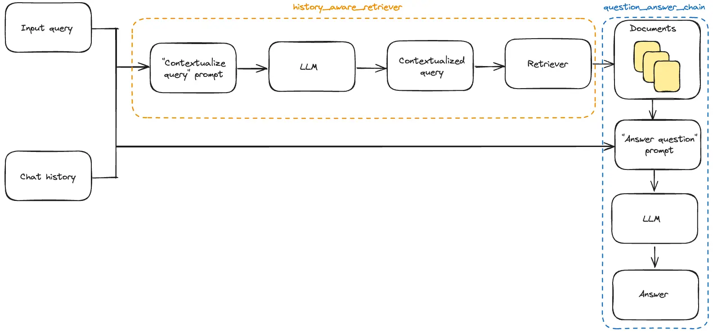

参考：https://www.langchain.com.cn/use_cases/question_answering/chat_history

```python
from langchain.chains import create_retrieval_chain
from langchain.chains.combine_documents import create_stuff_documents_chain
 
qa_system_prompt = """您是一个用于问答任务的助手。\
请使用以下检索到的上下文片段回答问题。\
如果不知道答案，请说不知道。\
最多使用三个句子，保持答案简洁。
 
{context}"""
qa_prompt = ChatPromptTemplate.from_messages(
    [
        ("system", qa_system_prompt),
        MessagesPlaceholder("chat_history"),
        ("human", "{input}"),
    ]
)
 
 
question_answer_chain = create_stuff_documents_chain(llm, qa_prompt)
 
rag_chain = create_retrieval_chain(history_aware_retriever, question_answer_chain)
```

```python
from langchain_core.messages import HumanMessage
 
chat_history = []
 
question = "What is Task Decomposition?"
ai_msg_1 = rag_chain.invoke({"input": question, "chat_history": chat_history})
chat_history.extend([HumanMessage(content=question), ai_msg_1["answer"]])
 
second_question = "What are common ways of doing it?"
ai_msg_2 = rag_chain.invoke({"input": second_question, "chat_history": chat_history})
 
print(ai_msg_2["answer"])
```

返回来源

```python
for document in ai_msg_2["context"]:
    print(document)
    print()
```



整体样例

```python
import bs4
from langchain import hub
from langchain.chains import create_history_aware_retriever, create_retrieval_chain
from langchain.chains.combine_documents import create_stuff_documents_chain
from langchain_community.chat_message_histories import ChatMessageHistory
from langchain_community.document_loaders import WebBaseLoader
from langchain_community.vectorstores import Chroma
from langchain_core.chat_history import BaseChatMessageHistory
from langchain_core.output_parsers import StrOutputParser
from langchain_core.prompts import ChatPromptTemplate, MessagesPlaceholder
from langchain_core.runnables import RunnablePassthrough
from langchain_core.runnables.history import RunnableWithMessageHistory
from langchain_openai import ChatOpenAI, OpenAIEmbeddings
from langchain_text_splitters import RecursiveCharacterTextSplitter
 
llm = ChatOpenAI(model="gpt-3.5-turbo", temperature=0)
 
 
### 构建检索器 ###
loader = WebBaseLoader(
    web_paths=("https://lilianweng.github.io/posts/2023-06-23-agent/",),
    bs_kwargs=dict(
        parse_only=bs4.SoupStrainer(
            class_=("post-content", "post-title", "post-header")
        )
    ),
)
docs = loader.load()
 
text_splitter = RecursiveCharacterTextSplitter(chunk_size=1000, chunk_overlap=200)
splits = text_splitter.split_documents(docs)
vectorstore = Chroma.from_documents(documents=splits, embedding=OpenAIEmbeddings())
retriever = vectorstore.as_retriever()
 
 
### 上下文化问题 ###
contextualize_q_system_prompt = """针对聊天历史记录和最新用户问题（可能引用聊天历史记录中的上下文），构造一个独立的问题，可以理解而不需要聊天历史记录。如果不知道答案，只需说不知道。如下所示简要回答，最多三句话。\
 
{context}"""
contextualize_q_prompt = ChatPromptTemplate.from_messages(
    [
        ("system", contextualize_q_system_prompt),
        MessagesPlaceholder("chat_history"),
        ("human", "{input}"),
    ]
)
history_aware_retriever = create_history_aware_retriever(
    llm, retriever, contextualize_q_prompt
)
 
 
### 回答问题 ###
qa_system_prompt = """您是一个用于问答任务的助手。使用以下检索到的上下文来回答问题。如果不知道答案，只需说不知道。最多使用三句话，并保持回答简洁。\
 
{context}"""
qa_prompt = ChatPromptTemplate.from_messages(
    [
        ("system", qa_system_prompt),
        MessagesPlaceholder("chat_history"),
        ("human", "{input}"),
    ]
)
question_answer_chain = create_stuff_documents_chain(llm, qa_prompt)
 
rag_chain = create_retrieval_chain(history_aware_retriever, question_answer_chain)
 
 
### 有状态地管理聊天历史记录 ###
store = {}
 
 
def get_session_history(session_id: str) -> BaseChatMessageHistory:
    if session_id not in store:
        store[session_id] = ChatMessageHistory()
    return store[session_id]
 
 
conversational_rag_chain = RunnableWithMessageHistory(
    rag_chain,
    get_session_history,
    input_messages_key="input",
    history_messages_key="chat_history",
    output_messages_key="answer",
)
```

```python
conversational_rag_chain.invoke(
    {"input": "什么是任务分解？"},
    config={
        "configurable": {"session_id": "abc123"}
    },  # 在`store`中构建了一个键为"abc123"的键。
)["answer"]
```