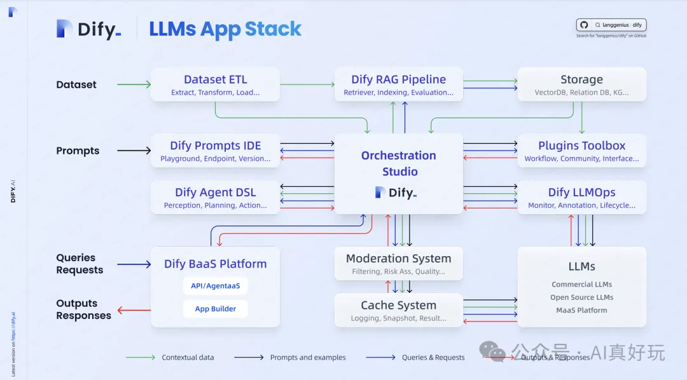
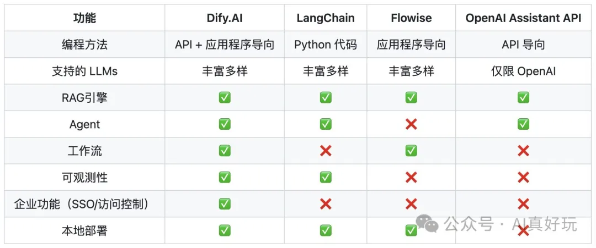
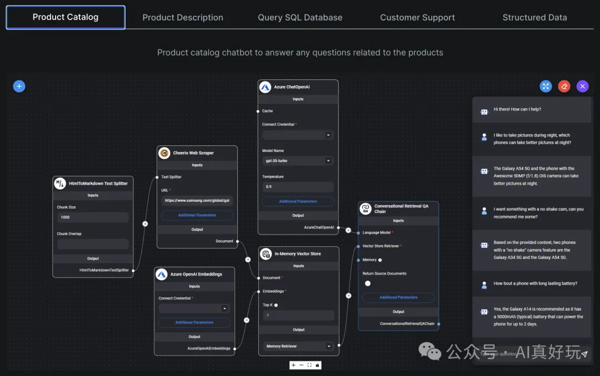
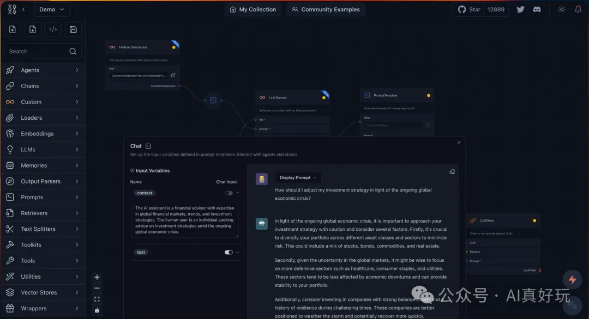

# 1. Dify（30.2K Star）

https://github.com/langgenius/dify

Dify 是一个开源的 LLM 应用开发平台。其直观的界面结合了 AI 工作流、RAG 管道、Agent、模型管理、可观测性功能等，让您可以快速从原型到生产。

以下是其核心功能列表：

1. Agent 智能体： 提供了 50 多种内置工具，如谷歌搜索、DELL·E、Stable Diffusion 和 WolframAlpha 等。

2. RAG Pipeline： 广泛的 RAG 功能，涵盖从文档摄入到检索的所有内容，支持从 PDF、PPT 和其他常见文档格式中提取文本的开箱即用的支持。

3. 工作流：在画布上构建和测试功能强大的 AI 工作流程，利用以下所有功能以及更多功能。

4. 全面的模型支持：涵盖 GPT、Mistral、Llama3 以及任何与 OpenAI API 兼容的模型。

5. Prompt IDE：用于制作提示、比较模型性能以及向基于聊天的应用程序添加其他功能（如文本转语音）的直观界面。

6. LLMOps：随时间监视和分析应用程序日志和性能。您可以根据生产数据和标注持续改进提示、数据集和模型。

7. 后端即服务：所有 Dify 的功能都带有相应的 API，因此您可以轻松地将 Dify 集成到自己的业务逻辑中。

# 2. Flowise（25.4K Star）

https://github.com/FlowiseAI/Flowise

拖放界面构建定制化的 LLM 流程

以下是其核心功能列表：

- LLM 编排：支持 LangChain、LlamaIndex 等 100 多个开箱即用的服务。

- Agents & Assistants：支持创建可以使用工具执行不同任务的自主代理。

- 友好的开发体验：支持 APIs、SDK 和嵌入式聊天扩展，方便快速集成到您的应用程序。

- 全面的模型支持：支持 HuggingFace, Ollama, LocalAI, Llama2, Mistral, Vicuna, Orca, Llava 等模型。

# 3. LangFlow（18K Star）

https://github.com/langflow-ai/langflow

Langflow 是一个动态图，每个节点都是一个可执行单元。它的模块化和交互式设计促进了快速实验和原型开发，挑战了创造力的极限。

以下是其核心功能列表：

- 开箱即用的组件：内置了 LLMs、Loaders、Memories、Vector Stores 等功能组件；

- 支持与第三方系统无缝集成：打通了与 Notion、Slack、Supbase、Google 等主流的平台之间的数据集成；

- 友好的开发体验：支持通过电子表格轻松微调 LLM，充分发挥 LLM 的潜力。支持自定义组件，满足不同的业务场景。

# 4. pyspur

GitHub (3k stars)：https://github.com/PySpur-Dev/pyspur

主要功能：

拖拽式构建：提供直观的拖拽界面，用户可以通过简单的拖拽操作快速构建、测试和迭代AI工作流，无需编写复杂代码。

循环与记忆功能：支持智能体在多次迭代中记住之前的状态，使模型能够从每次反馈中学习和优化，进行有效的决策和反馈循环。

文件上传与处理：用户可以上传文件或粘贴URL，支持文档解析、摘要提取等任务，方便处理各种文档数据。

结构化输出：提供JSON Schema的UI编辑器，帮助用户生成结构化的数据输出格式，便于数据接口与数据库存储。

RAG支持：支持解析、分块、嵌入数据到向量数据库，提升检索和生成模型的效率与精确性。

多模态支持：能够处理文本、图像、音频、视频等多种模态的数据，满足多样化的数据处理需求。

工具集成：支持与Slack、Google Sheets、GitHub等多种工具和平台的集成，增强工作流的功能，提升系统的整体协调性。

# 5. low-code-ai-platform

https://www.gitpp.com/dataorc/low-code-ai-platform

# 6. n8n

GitHub地址 (85k stars)：https://github.com/n8n-io/n8n

它跟fastgpt、dify、coze等LLM平台略有不同，n8n是专注workflow（工作流）这块的。可以集成LLM，但不限于此，可以更自由的定制AI流程。

最大的区别就是n8n的工作流节点更丰富，支持更加细粒度的配置，自由度更高，功能更强大

所以就workflow而言，n8n是绝对的专业、强大。

# 参考

[1] 3 款强大的开源低代码 LLM 编排工具，可视化定制专属 AI Agent 和 AI 工作流！，https://mp.weixin.qq.com/s?__biz=MzA5NDMwMTU3OA==&mid=2247484132&idx=1&sn=9d7197f5a1fd0cbf6e75b1d06bc086dd&scene=21#wechat_redirect
[2] 狂揽75K Star！最强开源AI Workflow平台【内置1500+工具和模板】效率起飞～, https://mp.weixin.qq.com/s/ctAqu27OZFL0Fp46d4R6Eg