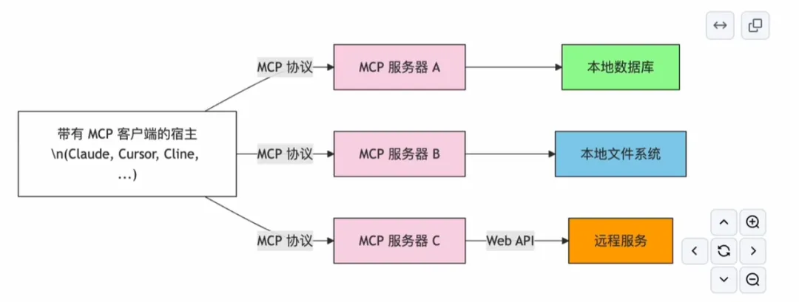
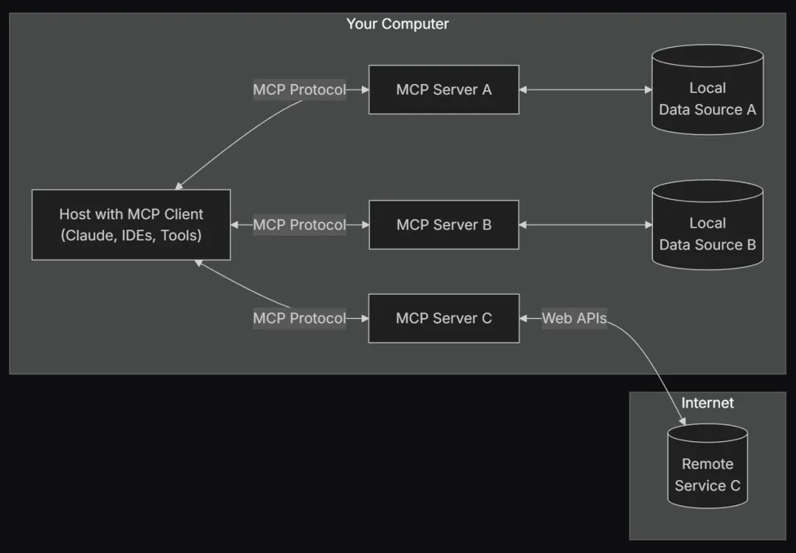

# 1. 定义



MCP 是一种 开放协议，用于 标准化应用程序向 LLM 提供上下文的方式。

你可以把 MCP 想象成 AI 应用的 USB-C 接口。正如 USB-C 提供了 标准化的方式 让设备连接到各种外设和配件，

MCP 提供了标准化方式，让 AI 模型 能够连接到 不同的数据源和工具。

🔹 为什么选择 MCP？

MCP 让你能够在 LLM 之上构建智能代理（Agents）和复杂工作流。

 LLM 需要与 数据和工具 集成，而 MCP 提供了：

 ✅ 丰富的预构建集成，LLM 可直接对接   
 ✅ 跨 LLM 供应商的灵活性，支持随时切换   
 ✅ 数据安全的最佳实践，确保数据存储在本地基础设施中   

🔹 MCP 的总体架构

MCP 采用 客户端-服务器（Client-Server）架构，其中主机应用可以连接多个 MCP 服务器：

```text
Internet
    ⬇
    Your Computer
    ⬇
    MCP Protocol
    ↙   ↓   ↘
MCP Server A  MCP Server B  MCP Server C
↙        ↓       ↘
Local Data A  Local Data B  Remote Service C
```



 MCP 主要组件：
- MCP 主机（Hosts）：如 Claude 桌面应用、IDE、AI 工具，用于通过 MCP 访问数据
- MCP 客户端（Clients）：负责 与 MCP 服务器建立 1:1 连接
- MCP 服务器（Servers）：轻量级程序，通过 标准化的 MCP 协议 提供特定能力
- 本地数据源（Local Data Sources）：你的 计算机文件、数据库和服务，MCP 服务器可以安全访问
- 远程服务（Remote Services）：可通过 API 访问的外部系统，MCP 服务器可以连接这些系统

# 参考

手把手教你，动手写一个MCP Server并在 Cline中使用！https://mp.weixin.qq.com/s/kxs5HEEWhFB8a2bsKbSQxw