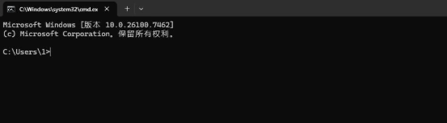
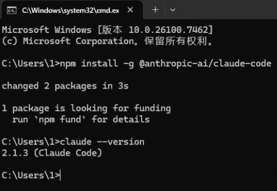
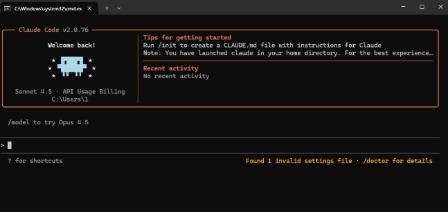
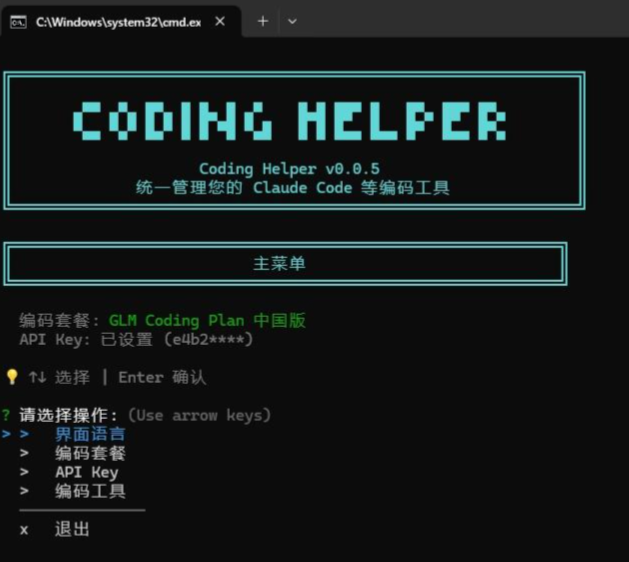
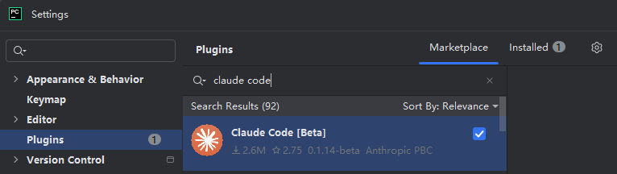
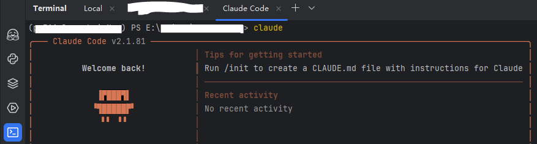
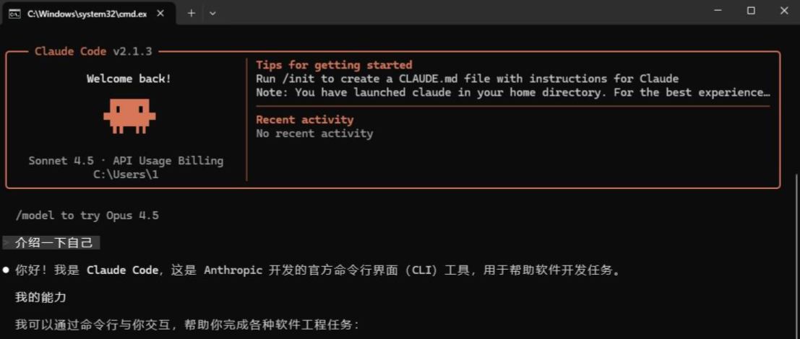

# 资源

- 官网：https://code.claude.com/docs/zh-CN/overview

# 前言

直接用Claude Code官网命令或者软件在国内访问不了，导致失败。

Claude Code 是 Anthropic 官方推出的 AI 编程助手，可以直接在终端、VS Code、JetBrains 等 IDE 中使用。它能：

🧠 理解你的整个代码库，跨文件编辑

🛠 运行命令、创建 PR、自动修 bug

📁 读写文件，操作 Git

🔌 通过 MCP 连接外部工具（Jira、Slack 等）

简单理解：它是一个住在你终端里的 AI 程序员，给它一句话就能帮你干活。

# 1. 前置安装准备

1. 先准备好科学的网络环境。
2. 安装最新版本的 Node.js：https://nodejs.org/en/download/
3. WIndows用户还需要额外安装 Git for Windows：https://git-scm.com/install/win

# 2. 安装和卸载Claude Code

## 2.1. 安装

Windows：快捷键Win+R，输入“cmd”并回车。
Mac：快捷键“Command（⌘）+空格键”打开搜索框，输入“终端”并回车。



输入命令：

```bash
npm install -g @anthropic-ai/claude-code
```

产看是否成功：

```bash
claude --version
```

如果能正常返回版本号，则代表安装无误。



在终端输入：

```bash
claude
```

可以看到欢迎界面：



## 2.2. 卸载

在终端中输入卸载命令：

```bash
npm uninstall -g @anthropic-ai/claude-code
```

# 3. 配置Claude Code

## 3.1. 方案1：文件配置（推荐）

更换国内模型。

用户目录下：`C:\Users\xxx用户名\.claude.json`

增加如下配置(用于免登录Claude Code，不然无法使用自有模型)：

```json
{
  "hasCompletedOnboarding": true
}
```

更新模型配置文件：C:\Users\xxx用户名\.claude

```json
{
"env": {
"ANTHROPIC_BASE_URL": "https://xxx.xxx.xx",
"ANTHROPIC_AUTH_TOKEN": "sk-xxxxxxxxxxxxxxxxxxxxxxxxxxxxxxxxxxxxxxxxxxxxx",
"CLAUDE_CODE_DISABLE_NONESSENTIAL_TRAFFIC": "1",
"CLAUDE_CODE_ATTRIBUTION_HEADER": "0",
"ANTHROPIC_MODEL": "gpt-5.4",
"ANTHROPIC_SMALL_FAST_MODEL": "gpt-5.4",
"ANTHROPIC_DEFAULT_SONNET_MODEL": "gpt-5.4",
"ANTHROPIC_DEFAULT_OPUS_MODEL": "gpt-5.4",
"ANTHROPIC_DEFAULT_HAIKU_MODEL": "gpt-5.4",
"CLAUDE_CODE_GIT_BASH_PATH": "C:\\Program Files\\Git\\bin\\bash.exe",
"PATH": "C:\\Program Files\\Git\\bin;${env:PATH}"
}
}
```

## 3.2. 方案2：环境变量

如果你用的是其他国产模型，也可以通过设置环境变量来接入，例如 Kimi：

在终端中进行配置（只对当前终端有效）：

MacOS 和 Linux：
```bash
# Linux/macOS 启动高速版 kimi-k2-turbo-preview 模型
export ANTHROPIC_BASE_URL=https://api.moonshot.cn/anthropic
export ANTHROPIC_AUTH_TOKEN=${YOUR_MOONSHOT_API_KEY}
export ANTHROPIC_MODEL=kimi-k2-turbo-preview
export ANTHROPIC_SMALL_FAST_MODEL=kimi-k2-turbo-preview

# 启动claude
claude
```

windows：
```bash
# Windows Powershell 启动高速版 kimi-k2-turbo-preview 模型
$env:ANTHROPIC_BASE_URL="https://api.moonshot.cn/anthropic";
$env:ANTHROPIC_AUTH_TOKEN="YOUR_MOONSHOT_API_KEY"
$env:ANTHROPIC_MODEL="kimi-k2-turbo-preview"
$env:ANTHROPIC_SMALL_FAST_MODEL="kimi-k2-turbo-preview"

# 启动claude
claude
```

这种配置方式，最好把环境变量放置到系统变量中

## 3.3. 方案3：Claude中配置

如果你是用智谱AI，那在终端输入 npx @z_ai/coding-helper，就能打开这个页面。

通过键盘上下键和回车键进行操作选择。

通过键盘上下键和回车键进行操作选择。



然后按照中文提示粘贴API Key 即可一键导入配置。

# 4. 使用
## 4.1. Pycharm插件安装和使用

在插件市场搜索



安装完之后，在pycharm的右上角启动


在pycharm下面的命令行窗口即可启动：



## 4.2. 命令行使用

以后使用就在命令行中输入：

```bash
cd /path/to/your/project
claude
```



# 5. 常用命令

```text
/init：初始化项目，生成 `CLAUDE.md` 文件。这相当于给 AI 递了一份“项目说明书”。
/status：查看当前版本、模型、接口和代理状态。
/clear：发现 AI 聊“跑偏”了？直接清空历史，重新开始。
/compact：对话太长容易“溢出”失忆？用这个命令压缩上下文，保留重点。
/model：查看或切换当前使用的 AI 模型。


claude -c 直接进入上次对话；

claude -r 打开历史对话记录（使用较多）；
```

# 参考

[1] Claude Code国内使用指南：从安装到接入国产模型，手把手教学， https://zhuanlan.zhihu.com/p/1993293785019465960