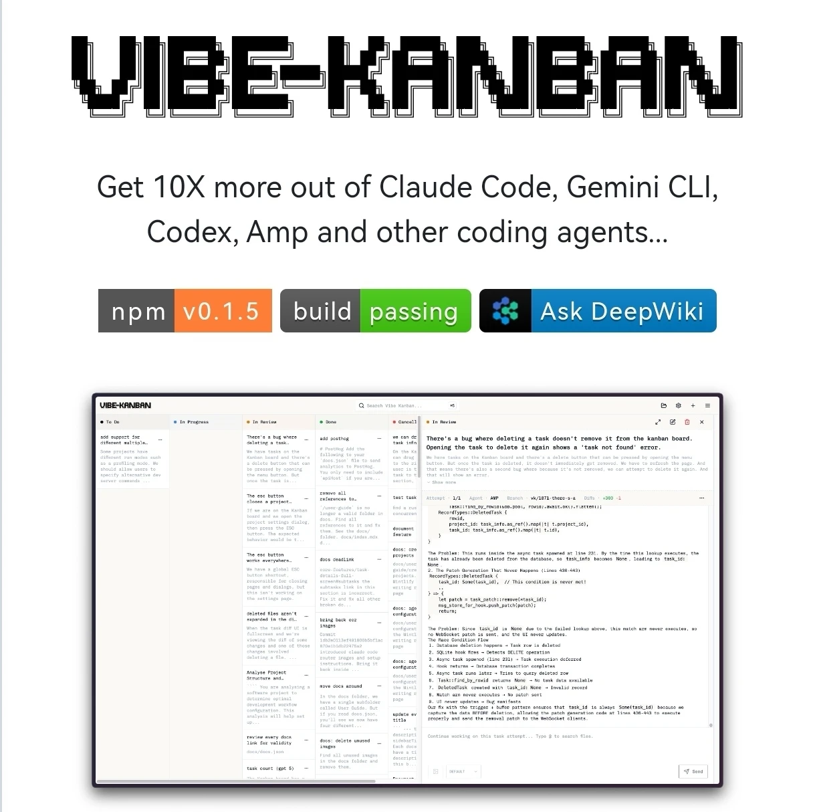

Vibe看板工具震撼发布一键掌握AI编程
程序员现在将大部分时间用于规划、审查和协调任务。Vibe看板工具简化了这一流程，使您能够：

- 自由切换不同AI编程助手
- 同时指挥多个AI并行工作
- 秒级审查代码+秒启开发服务器
- 实时追踪所有AI任务进度
- 统一配置管理，告别混乱

技术栈速览：
• Rust（最新版）
• Node.js（≥18）
• pnpm（≥8）

项目地址：github.com/tryemerge/vibe-factory

有了这个可视化看板，是不是能让多个AI乖乖听话？

#ai #agent #agent搭建 #程序员必备工具推荐#编程新手入门指南 #程序员必备工具推荐 #提升工作效率秘籍 #VibeKanban编程神器 #AI编程助手集成 #提升开发效率X倍 #一键管理代码流程 #实时代码审查技巧 #轻松切换AI助手 #高效任务管理方法

# 参考

[1] https://mp.weixin.qq.com/s/kdmiPcINS_L-dGqhC4oHoA