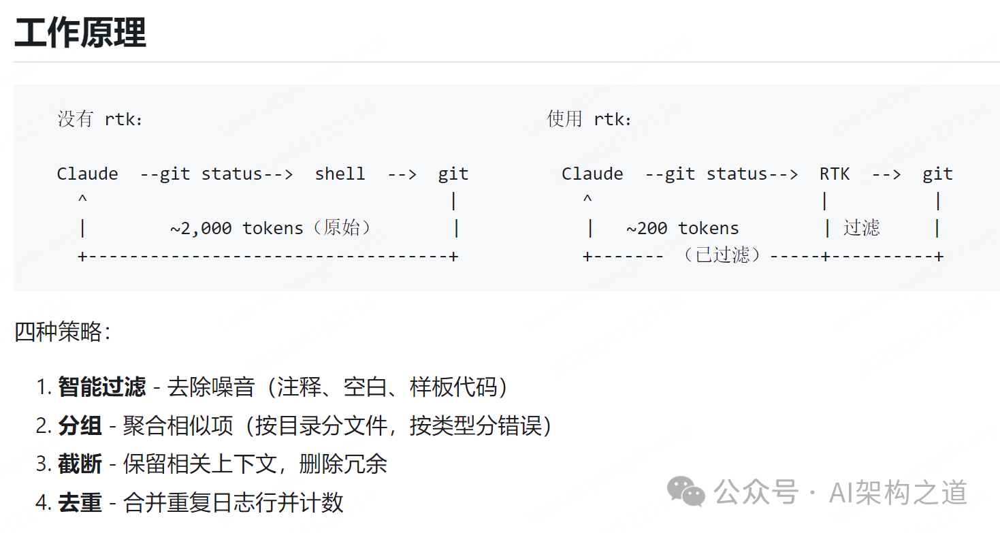
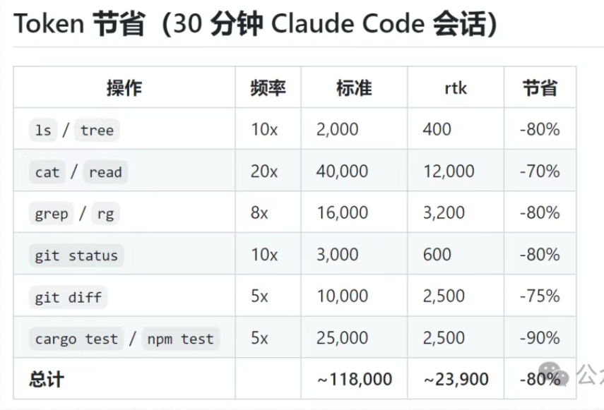

01开发痛点

用 Claude Code、Cursor 等 AI 编程助手开发时，几乎所有人都会遇到这3个核心痛点：
- 上下文易“撑爆”：终端命令（如cargo test、git diff）输出大量日志、空行、警告，80% 都是无效噪音，快速占满 AI 上下文窗口，导致会话突然截断、AI“失忆”。
- Token 成本高昂：无效输出疯狂消耗 token 配额，按月付费用户每月要多花不少成本，明明没解决多少问题，额度却已告急。
- AI 效率低下：大量垃圾信息干扰 AI 推理，让模型难以抓住核心代码逻辑，回复变慢、准确率下降，反而拖慢开发节奏。

RTK，全称为 Rust Token Killer ，是一款基于 Rust 开发的轻量级 CLI 代理工具，专门为 AI 编程场景设计，核心定位就是“净化终端输出、节省 AI Token”。

项目核心信息：
- 开源协议：MIT 协议（可自由使用、二次开发）
- 核心特性：单二进制文件、零依赖、全平台支持，兼容所有主流 AI 编程助手
- 实测效果：30分钟开发会话可节省 88.9% Token，部分命令压缩率高达 99%

核心说明：4层净化策略，层层递进，不丢干货只删垃圾，实现80%+ Token 节省

RTK 能实现极致的 Token 节省，核心靠4层组合式净化策略，层层递进，既保证不丢失关键信息，又能最大化压缩无效输出，这也是它区别于普通终端工具的核心竞争力：
- 智能过滤：最基础也是最关键的一步，直接剔除终端输出中的“无效噪音”，包括注释、空行、样板代码、ANSI 颜色码、进度条、无关警告等，从源头减少 Token 消耗。
- 分组聚合：将同类输出信息合并展示，避免重复铺开。比如搜索结果按文件分组，错误信息按类型归类，日志按模块收拢，让 AI 能快速抓取核心内容。
- 智能截断：基于启发式算法，保留最有价值的上下文（如代码关键片段、错误核心原因），砍掉重复、长尾、无意义的输出片段，避免冗余信息占用 Token。
- 去重合并：针对日志类输出，将反复出现的相同行自动合并，附带出现次数，比如“连接超时”重复10次，会合并为“连接超时（10次）”，大幅缩短输出长度。

这4种策略协同工作，形成一套完整的“终端输出净化流程”，实现“无损核心信息、极致压缩体积”的效果，也是 RTK 能做到 80%+ Token 节省的核心原因。

