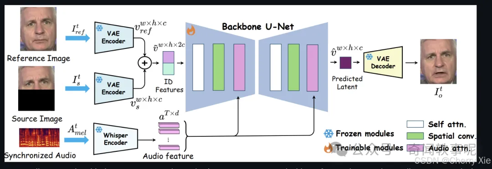
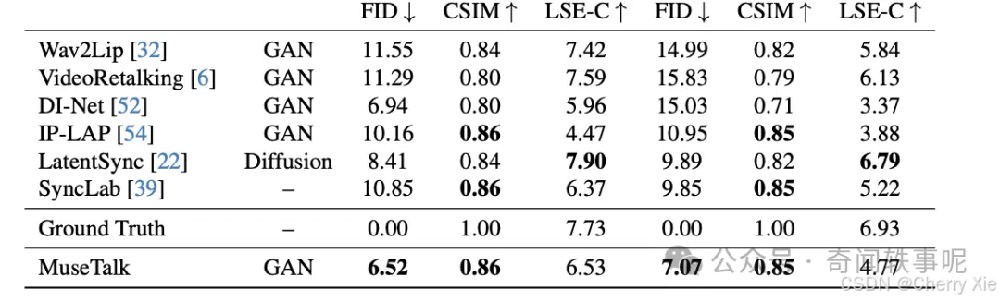

# 包含视觉

# 1. Fay

Fay是一个完整的开源项目，包含Fay控制器及数字人模型，可灵活组合出不同的应用场景：虚拟主播、现场推销货、商品导购、语音助理、远程语音助理、数字人互动、数字人面试官及心理测评、贾维斯、Her。开源项目，非产品试用！！！

源代码

http://www.gitpp.com/pythonking/Fay

数字人技术的核心难点主要包括以下几个方面：

人工智能算法：数字人的核心技术之一是人工智能算法，包括深度学习、自然语言处理、计算机视觉等方面的技术。这些算法需要不断优化和改进，以提高数字人的智能化水平，使其能够更自然地与人类交流互动。

语音交互技术：数字人需要具备与人类进行语音交互的能力，包括语音识别、语音合成等技术。这些技术需要解决不同口音、语速、噪音等干扰因素的问题，以实现高效准确的语音交互。

虚拟现实技术：数字人通常需要与虚拟现实技术结合，构建出逼真的虚拟场景，使用户能够沉浸其中并与数字人进行互动。这需要解决虚拟场景建模、渲染、交互等方面的技术难题。

情感识别与表达：数字人需要能够识别和表达情感，与人类进行情感交流。这需要解决情感识别、情感建模和情感表达等技术问题，以实现更自然的情感交互。

多模态交互技术：数字人需要能够理解和回应人类通过语言、姿态、表情等多种模态传递的信息。这需要解决多模态信息融合、理解和生成等技术难题，以实现更丰富的交互方式。

数据安全与隐私保护：数字人在处理用户信息时需要保证数据的安全性和隐私性。这需要采取有效的加密技术、访问控制等手段，防止用户信息被泄露和滥用。

综上所述，数字人技术的核心难点涵盖了人工智能算法、语音交互技术、虚拟现实技术、情感识别与表达、多模态交互技术以及数据安全与隐私保护等多个方面。这些技术难题的解决将推动数字人技术的进一步发展和应用。

# 2. marketing_creator_pro

简介

高颜值AI数字人克隆、声音克隆、短视频生成、直播（待发布）、AI配音、AI字幕，包括Windows安装版，Web版，H5版，小程序版，副业必备。

功能列表

• 数字人训练
• 声音克隆
• 口播视频生成（支持自定义文案、人物、音色、字幕等）

Windows安装版、Web版-开源地址：
https://github.com/libn-net/marketing_creator_pro_max_pc

H5、小程序版-开源地址：
https://github.com/libn-net/marketing_creator_pro_max_uni

后端API-开源地址：
https://github.com/libn-net/marketing_creator_pro_max_backend

# 3. NarratoAI

项目地址：https://github.com/linyqh/NarratoAI

简介

NarratoAI 是一个自动化影视解说工具，基于LLM实现文案撰写、自动化视频剪辑、配音和字幕生成的一站式流程，助力高效内容创作。

功能
• 支持 DeepSeek R1 和 DeepSeek V3 模型进行短剧混剪
• 支持阿里 Qwen2-VL 模型理解视频；支持短剧混剪

配置要求 📦

- 建议最低 CPU 4核或以上，内存 8G 或以上，显卡非必须
- Windows 10 或 MacOS 11.0 以上系统
- Python 3.10+

# 4. 阿里轻量级数字人，可在CPU上运行

https://github.com/HumanAIGC/lite-avatar

# 5. HeyGem
HeyGem 重塑了内容生成逻辑：零训练、秒级生成，一张照片一段语音，几十秒生成 4K 数字人；

https://github.com/GuijiAI/HeyGem.ai

HeyGem是一款专为Windows系统设计的完全离线视频合成工具，能够精确克隆外貌和声音，实现形象的数字化。可以通过文本和语音驱动虚拟形象来创建视频。无需联网，既保护了您的隐私，又能让您享受便捷高效的数字体验。

# 6. DUIX

https://github.com/GuijiAI/duix.ai

DUIX 则瞄准人机交互这个核心接口，主打三行代码接入、低算力运行、强实时互动，正在成为企业与开发者争相集成的数字人基础设施。

一句话概括：DUIX是一个能“听你说话、懂你情绪、及时回应”的AI交互数字人引擎。

只需短短几行调用，就能快速接入一个具备语音识别、语言生成、多模态感知的数字人交互框架。更重要的是，它的模型经过极致压缩，可在手机、网页、车机等端侧轻松部署，50帧高帧率自然运行，不依赖重型云渲染，不卡、不延迟、还能随时定制。

一句话说透它：DUIX 就是“数字人行业的 Webpack”——一个跨平台、即插即用、灵活调用的开发基建。

PC入口：https://app.guiji.cn/openPlatform

# 7. AigcPanel

AigcPanel是一个简单易用的一站式AI数字人系统，小白也可使用。支持视频合成、声音合成、声音克隆，简化本地模型管理、一键导入和使用AI模型。

🔗https://github.com/modstart-lib/aigcpanel

# 8. SecondMe

- Github (8.5k stars): https://github.com/mindverse/Second-Me

一个开源原型，您可以在其中打造自己的 AI 自我 — 一种新的 AI 物种，可以保护您、提供您的背景并捍卫您的利益。

它在本地训练和托管 — 您的数据、您的控制权 — 但在全球范围内连接，从而在 AI 网络中扩展您的智能。除此之外，它还是您的 AI 身份接口 — 一个将您的 AI 与世界连接起来的大胆标准，激发 AI 自我之间的协作，并构建未来真正的原生 AI 应用程序。

技术爱好者、AI 专业人士、领域专家，加入我们！Second Me 是您将思维扩展到数字视野的跳板。

# 9. OmniTalker

阿里的通义实验提出了 OmniTalker，一个从文本联合生成语音和说话视频的统一框架，它减轻了现有方法中冗余计算、错误积累和视听风格不匹配的痛苦。支持零样本上下文多模态生成、情感表达生成、长视频一致性生成以及交互式演示。

- 论文：https://arxiv.org/pdf/2504.02433v1
- 代码：https://github.com/HumanAIGC/omnitalker
- 主页：https://humanaigc.github.io/omnitalker/

# 10. sonic

https://github.com/jixiaozhong/Sonic.git

腾讯与浙大研究者最近开源一款Sonic数字人模型，一种专注于全局音频感知的音频驱动的肖像动画生成极其逼真的数字人动画视频方法。通过上下文增强的音频学习、运动解耦控制器和时间感知的位移融合，Sonic显著提高了视频质量、运动多样性、自然性和时间一致性。在github社区 star量达1k!

# 11. HeyGem-Linux-Python-Hack

- Github (175 stars): https://github.com/Holasyb918/HeyGem-Linux-Python-Hack

是一个基于 Python 的数字人项目，它从 HeyGem.ai 中提取出来，它能够直接在 Linux 系统上运行，摆脱了对 Docker 和 Windows 系统的依赖。目标是提供一个更易于部署和使用的数字人解决方案。

主要特性

- 无需 Docker: 直接在 Linux 系统上运行，简化部署流程。
- 无需 Windows: 完全基于 Linux 开发和测试。
- Python 驱动: 使用 Python 语言开发，易于理解和扩展。
- 开发者友好: 易于使用和扩展。
- 完全离线。

# 12. MuseTalk 1.5

- 技术报告：https://arxiv.org/pdf/2410.10122
- github地址：https://github.com/TMElyralab/MuseTalk
- 模型下载：https://huggingface.co/TMElyralab/MuseTalk

MuseTalk 是一个开源模型，发布在 GitHub 和 Hugging Face ，支持与 MuseV 结合，形成完整的虚拟人类生成解决方案。它在 NVIDIA Tesla V100 上实现 30fps+ 的实时推理，处理多种语言音频（如中文、英文、日语），并通过 UNet 架构和 HDTF 数据集训练 。

- 性能提升
  - 损失函数集成：MuseTalk 1.5 集成了感知损失（perceptual loss）、生成对抗网络损失（GAN loss）和同步损失（sync loss），显著提升了模型的整体性能 。 感知损失提升视觉质量，确保生成的视频在细节上更清晰。
  - GAN 损失增强生成图像的真实感，减少伪影。
  - 同步损失优化唇部与音频的匹配精度，减少时间延迟。
  - 效果：这些改进确保了更高的清晰度、身份一致性和精确的唇部-语音同步 。
- 训练策略优化
  - 两阶段训练策略：MuseTalk 1.5 采用了两阶段训练策略，可能包括先预训练再微调的流程 。
  - 第一阶段可能专注于基础特征提取，第二阶段优化唇部同步细节，提升模型的稳定性和泛化能力。
  - 时空数据采样方法：引入了时空数据采样（spatio-temporal data sampling），在训练期间选择与目标帧头部姿势相似的参考图像 。
  - 此方法帮助模型专注于精确的唇部运动，过滤冗余信息，平衡视觉质量和唇部同步精度。

---

# 无视觉部分

# 1. WeClone

- Github (7k stars): https://github.com/xming521/WeClone
- 从聊天记录创造数字分身的一站式解决方案💡 使用聊天记录微调大语言模型，让大模型有“那味儿”，并绑定到聊天机器人，实现自己的数字分身。 数字克隆/数字分身/数字永生/LLM/聊天机器人/LoRA
  - 💫 涵盖打造数字分身的全链路方案，包括聊天数据导出、预处理、模型训练、部署
  - 💬 使用微信聊天记录微调LLM，让大模型有"那味儿"
  - 🔗 绑定到微信、QQ、Telegram、企微、飞书机器人，实现自己的数字分身
  - 🛡️ 隐私信息过滤，本地化微调部署，数据安全可控

# 参考

[1] 完整的数字人开源项目，包含控制器及数字人模型，https://mp.weixin.qq.com/s/xv3XegxixyNHQf8uAyKBXg
[2] 数字人技术再突破！阿里通义提出OmniTalker，从文本联合生成语音和说话视频，支持多种生成方式！https://mp.weixin.qq.com/s/l61-22uQsddc08S6rBN_OQ
[3] 一键包：图片到数字人，效果还是很惊艳的，完全本地部署, https://mp.weixin.qq.com/s/B9ZsJzp15oFSgMeLzPTk8Q
[4] 腾讯发布数字人框架MuseTalk 1.5，开放训练逻辑，生成效果进一步优化～，https://mp.weixin.qq.com/s/BD7rLwo8pNrOw30s78293Q