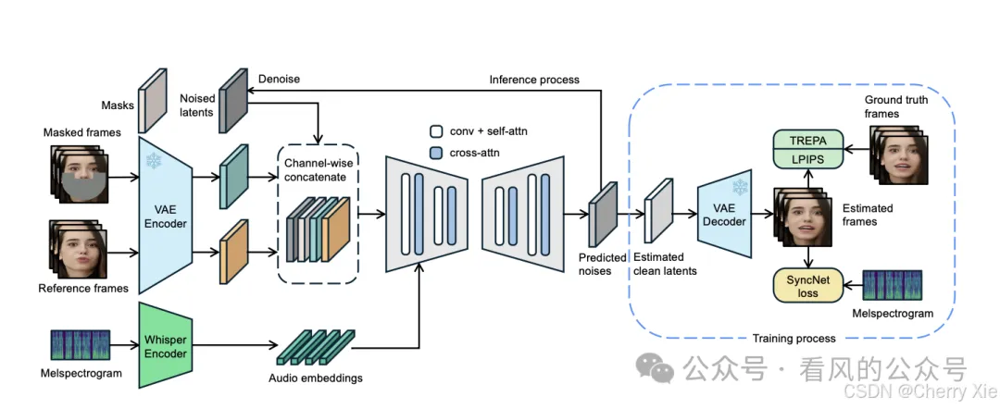
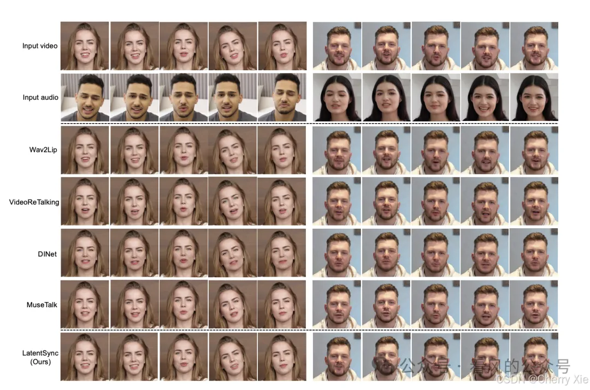
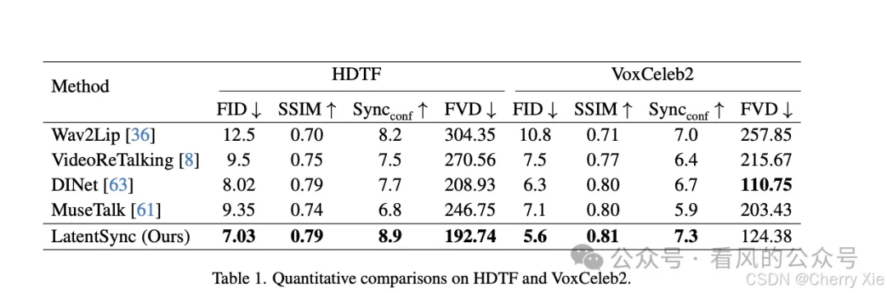

# 1. 资源

- Paper: https://arxiv.org/abs/2412.09262
- Code: https://github.com/bytedance/LatentSync
- 模型：https://modelscope.cn/models/ByteDance/LatentSync-1.5

# 2. 简介

LatentSync 是字节跳动联合北京交通大学推出的端到端唇形同步框架 ，基于音频驱动的潜在扩散模型，在AnimateDiff的基础上构建。并结合了MuseTalk、StyleSync、SyncNet、Wav2Lip等唇同步技术的特点。能够生成高质量、时间一致的动态视频，适用于虚拟人、游戏、配音等场景。

# 3. 技术原理
潜在扩散模型（LDM）

通过将音频频谱图编码为潜在空间表示，直接驱动视频生成，无需依赖中间3D模型或2D特征点。

时间表示对齐（TREPA）

采用时间一致性增强模块，确保生成视频中唇部动作与音频在时序上精准匹配，减少口型延迟或错位。

Whisper音频嵌入

利用Whisper模型提取音频语义特征，提升对语音内容的理解能力，使口型生成更自然。

**核心功能**

- 高分辨率输出：支持生成1080p及以上分辨率的视频，细节表现接近真实人脸。
- 端到端生成：直接输入音频即可生成同步唇形视频，无需手动调整中间步骤（如3D建模或关键帧动画）。
- 动态一致性：在长视频中保持唇部动作的连贯性，避免传统方法中因分段处理导致的跳跃感。

# 4. 性能

# 参考

[1] 字节跳动开源-实测最快的数字人视频生成模型LatentSync，没有之一！https://mp.weixin.qq.com/s/JAm--oOaF_GEVi8IJ-DxuA