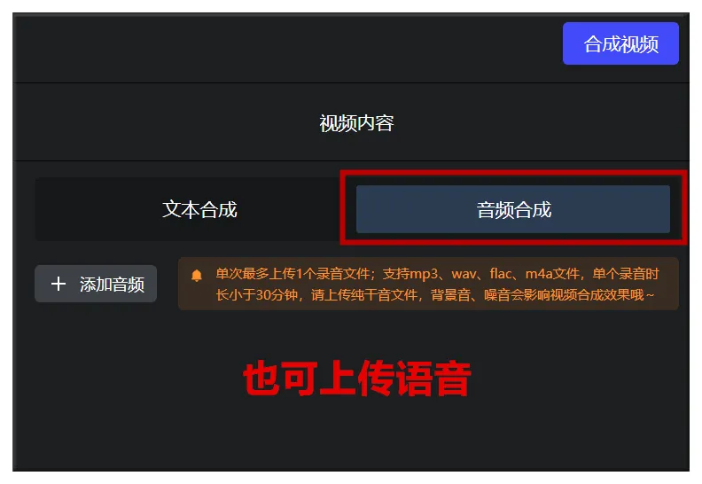

# 介绍
市面上效果优秀的数字人产品，通常价格昂贵（比如HeyGen），不过近期硅基智能开源了一款工具HeyGem，可作为平替。接下来就讲讲本地部署方法（Windows）。开始之前请确保你已经安装了Git、Python等基本工具，并保持网络畅通。

文章涉及的网址

- HeyGem项目页面：https://github.com/GuijiAI/HeyGem.ai?tab=readme-ov-file
- Dokcer下载页面：https://www.docker.com

# 一、环境准备

## 1、安装wsl

点击Windows开始按钮，输入windows powershell，点击进入命令模式：


运行：wsl --list --verbose 查看是否已经安装wsl，已安装则无需再安装：


如果没有安装，则运行：wsl --install

## 2、安装Docker

从：https://www.docker.com 下载，选择如图版本：


下载后安装，选项全默认，完成后需要重启Windows：


重启后需要同意Docker的条款：


Docker可以不注册账号直接用，这里要选Continue without signing in：


打开Docker之后，建议先设置硬盘，否则仅Heygem的模型就有70G，还不包括其他内容，可能会塞爆你的C盘。

点击右上方设置键，然后依次选择Resources、Adavanced、Disk image location，更改硬盘目录，然后点击Apply按钮：


# 二、安装服务端
在你想安装HeyGem的硬盘目录下点右键，选择“在终端打开”，进入命令模式：


依次执行下列命令：

```shell
git clone https://github.com/GuijiAI/HeyGem.ai.git
```

cd /HeyGem.ai/deploy

docker-compose up -d（如果显卡显存较小，可使用lite版本，执行：docker-compose -f docker-compose-lite.yml up -d）

然后开始下载模型，70G容量需要一段时间：


完成之后，在Docker Container菜单可以看到名为deploy的条目：


点击deploy，应该可以看到三个相应的服务均已启动，至此服务端安装完成。


# 三、安装客户端

进入：https://github.com/GuijiAI/HeyGem.ai/releases 页面下载名为“HeyGem-x.x.x-setup.exe”的最新版本：


下载完成后，双击安装。这个文件不大，安装到默认目录即可：


# 四、使用方法

安装完客户端后，运行进入主界面：


首先点击“快速定制”，然后选择准备好的素材，点击“提交定制”：


完成之后会有提示，然后进入“短视频制作”界面，准备合成数字人视频：


这里有两种方法：

1、直接输入文本，用HeyGem克隆语音。这个方法存在局限，尤其当素材人物和数字人不是同一语种（比如素材讲英文，想要数字人讲中文），就无法正常生成。


2、上传由其他第三方工具克隆的语音，再用HeyGem合成。



选择完成后，点击“合成视频”：


点击“去看制作进度”回到工具主界面，等进度完成即可，一般需要几分钟。


# 五、硬件需求

1、本项目需要一定的硬件条件，官方推荐配置为：

系统：Windows 10 19042.1526 或更高

CPU：英特尔 i5-13400F

内存：32G及以上

显卡：RTX 4070

以上配置并非绝对，但总的来说，没有英伟达中端以上显卡的就不用试了。

2、你的硬盘必须要有D盘，因为工具运行时会给D盘建立一个heygem_data目录：


# 六、使用体验

1、对于真人正面素材，HeyGem生成效果较好，适合口播、带货等应用场景。

2、对于真人侧面素材、动漫形象、动物形象的支持度不佳。

3、开源的客户端功能非常简单（甚至简陋），语音无法控制情绪、节奏等内容，如果你的要求很高，未必能满足。

4、根据用户协议，HeyGem的商用受到一定限制，具体需咨询官方。

# 参考 

[1] 开源数字人HeyGem部署教程，口播、带货、动画样样行, https://mp.weixin.qq.com/s/43aRuIDCa216Yg7k6mZmSg