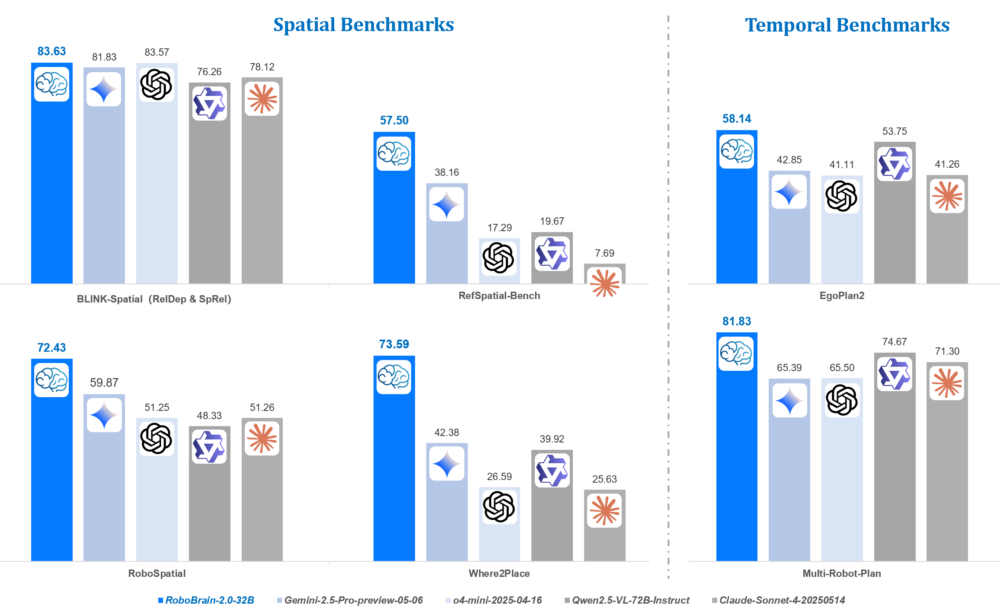
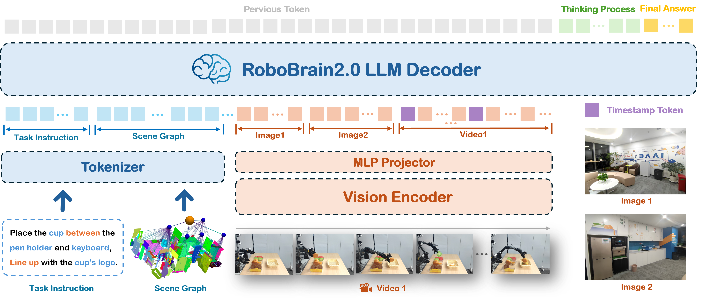

- Github (685 stars): https://github.com/FlagOpen/RoboBrain2.0 

我们很高兴推出 RoboBrain 2.0，这是迄今为止最强大的开源具身大脑模型。与其前身 RoboBrain 1.0 相比，我们的最新版本旨在统一物理环境中复杂具身任务的感知、推理和规划。它有两种变体：轻量级 7B 型号和全尺寸 32B 型号，具有带有视觉编码器和语言模型的异构架构。尽管尺寸紧凑，但 RoboBrain 2.0 却取得了强大的性能 跨越广泛的具体推理任务。在空间和时间基准测试中，32B 变体在大多数情况下都取得了领先的结果，超过了之前的开源和专有模型。 特别是，它支持关键的现实世界具身智能能力，包括空间理解（例如可供性预测、空间参考、轨迹预测）和时间决策（例如闭环交互、多智能体长视野规划和实时场景记忆）。本报告详细介绍了模型架构、数据构建、多阶段训练策略、基础设施和实际应用。我们希望 RoboBrain 2.0 能够推进具身人工智能研究，并成为构建通才具身代理的实际步骤。

🚀 特征
RoboBrain 2.0 支持具有远视距规划和闭环反馈的交互推理、用于复杂指令精确点和 bbox 预测的空间感知、用于未来轨迹估计的时间感知以及通过实时结构化记忆构建和更新的场景推理。

⭐️结构

RoboBrain 2.0 支持多图像、长视频和高分辨率视觉输入，以及复杂的任务指令和语言端的结构化场景图。视觉输入通过视觉编码器和 MLP 投影仪进行处理，而文本输入则被标记化为统一的标记流。所有输入都被输入到一个 LLM 解码器中，该解码器执行长链思维推理并输出结构化计划、空间关系以及相对坐标和绝对坐标。

