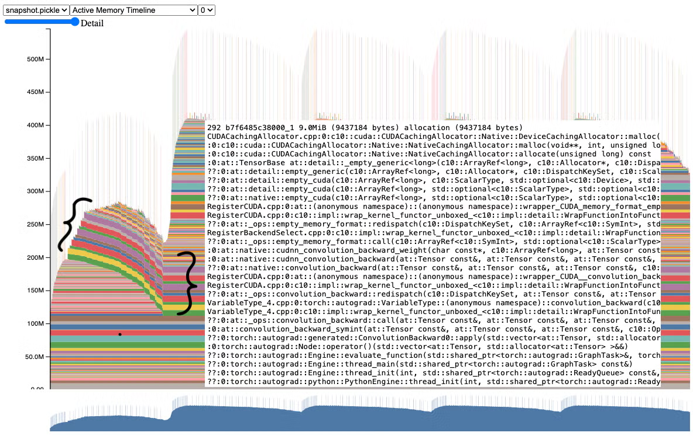

# 1. 资源

- 博客：Understanding GPU Memory 1: Visualizing All Allocations over Time, https://pytorch.org/blog/understanding-gpu-memory-1/
- 文档：Understanding CUDA Memory Usage， https://docs.pytorch.org/docs/main/torch_cuda_memory.html
- 文档：torch.profiler： https://docs.pytorch.org/docs/main/profiler.html
- 集成到tensorboard: https://github.com/pytorch/kineto/blob/main/tb_plugin/README.md
- 使用本工具参考项目：https://github.com/xingchensong/TouchNet

内存快照工具为调试 GPU OOM 提供了精细的 GPU 内存可视化。捕获的内存快照将显示内存事件，包括分配、释放和 OOM，以及它们的堆栈跟踪。

在快照中，每个张量的内存分配都是单独进行颜色编码的。x 轴是随时间变化的，y 轴是 GPU 内存量（以 MB 为单位）。快照是交互式的，因此我们可以通过将鼠标悬停在上面来观察任何分配的堆栈跟踪。在 https://github.com/pytorch/pytorch.github.io/blob/site/assets/images/understanding-gpu-memory-1/snapshot.html 亲自尝试。

# 2. 案例


**ResNet50 存在错误**

我们已经在第一个快照中查看了一个正常工作的模型。现在，让我们看一个有 bug 的训练示例，见 snapshot：


请注意，第二次迭代使用的内存比第一次迭代多得多。如果这个模型要大得多，它可能会在第二次迭代中进行 CUDA OOM，而无需更深入地了解原因。



在进一步检查此快照时，我们可以清楚地看到，从第一次迭代到第二次和以后的迭代，几个张量都保持活动状态。如果我们将鼠标悬停在其中一个张量上，它将显示一条堆栈轨迹，表明这些是梯度张量。

事实上，如果我们去看代码，我们可以看到它并没有清除梯度张量，而它本可以在正向之前清除它们。

以前：

```python
for _ in range(num_iters):
    pred = model(inputs)
    loss_fn(pred, labels).backward()
    optimizer.step()
```

后：

```python
for _ in range(num_iters):
    pred = model(inputs)
    loss_fn(pred, labels).backward()
    optimizer.step()
    # Add this line to clear grad tensors
    optimizer.zero_grad(set_to_none=True)
```

我们可以简单地添加一条指令来清除每次迭代的梯度张量（有关为什么我们需要将梯度归零的更多详细信息，请参阅：https://pytorch.org/tutorials/recipes/recipes/zeroing_out_gradients.html）。optimizer.zero_grad(set_to_none=True)

这是我们在使用此工具的更复杂的程序中发现的一个错误的简化。我们鼓励您尝试 GPU 内存问题的内存快照，并告诉我们它的进展情况。

**修复错误后的 ResNet50**


但你可能想知道，为什么第一次迭代后内存仍然增加？为了回答这个问题，我们来访问下一节的 Memory Profiler。

**分类内存使用情况**

内存分析器是 PyTorch 分析器的一项附加功能，用于对一段时间内的内存使用情况进行分类。我们仍然依赖 Memory Snapshot 进行堆栈跟踪，以深入了解内存分配。

要生成内存时间线，下面是一个代码片段（附录 B 中的完整代码示例）：

```python
# Initialize the profiler context with record_shapes, profile_memory,
# and with_stack set to True.
with torch.profiler.profile(
   activities=[
       torch.profiler.ProfilerActivity.CPU,
       torch.profiler.ProfilerActivity.CUDA,
   ],
   schedule=torch.profiler.schedule(wait=0, warmup=0, active=6, repeat=1),
   record_shapes=True,
   profile_memory=True,
   with_stack=True,
   on_trace_ready=trace_handler,
) as prof:
   # Run the PyTorch Model inside the profile context.
   for _ in range(5):
       prof.step()
       with record_function("## forward ##"):
           pred = model(inputs)

       with record_function("## backward ##"):
           loss_fn(pred, labels).backward()

       with record_function("## optimizer ##"):
           optimizer.step()
           optimizer.zero_grad(set_to_none=True)

# Construct the memory timeline HTML plot.
prof.export_memory_timeline(f"{file_prefix}.html", device="cuda:0")
```

Memory Profiler 根据性能分析期间记录的张量运算图自动生成类别。


在使用 Memory Profiler 收集的 Memory Timeline 中，我们有与之前相同的训练示例。我们可以观察到蓝色的渐变现在正在从一次迭代到另一个迭代被清除。我们还可以注意到，黄色的优化器状态是在第一次迭代后分配的，并且在作业的其余部分保持不变。

这种优化器状态是 GPU 内存从第一次迭代增加到第二次迭代的原因。自己尝试代码（请参阅附录 B 中的代码示例）。Memory Profiler 有助于提高对训练内存的理解，以便模型作者可以找出哪些类别使用的 GPU 内存最多。

# 3. 附录
## 3.1 附录 A – ResNet50 内存快照代码示例

```python
# (c) Meta Platforms, Inc. and affiliates. 
import logging
import socket
from datetime import datetime, timedelta

import torch

from torchvision import models

logging.basicConfig(
   format="%(levelname)s:%(asctime)s %(message)s",
   level=logging.INFO,
   datefmt="%Y-%m-%d %H:%M:%S",
)
logger: logging.Logger = logging.getLogger(__name__)
logger.setLevel(level=logging.INFO)

TIME_FORMAT_STR: str = "%b_%d_%H_%M_%S"

# Keep a max of 100,000 alloc/free events in the recorded history
# leading up to the snapshot.
MAX_NUM_OF_MEM_EVENTS_PER_SNAPSHOT: int = 100000

def start_record_memory_history() -> None:
   if not torch.cuda.is_available():
       logger.info("CUDA unavailable. Not recording memory history")
       return

   logger.info("Starting snapshot record_memory_history")
   torch.cuda.memory._record_memory_history(
       max_entries=MAX_NUM_OF_MEM_EVENTS_PER_SNAPSHOT
   )

def stop_record_memory_history() -> None:
   if not torch.cuda.is_available():
       logger.info("CUDA unavailable. Not recording memory history")
       return

   logger.info("Stopping snapshot record_memory_history")
   torch.cuda.memory._record_memory_history(enabled=None)

def export_memory_snapshot() -> None:
   if not torch.cuda.is_available():
       logger.info("CUDA unavailable. Not exporting memory snapshot")
       return

   # Prefix for file names.
   host_name = socket.gethostname()
   timestamp = datetime.now().strftime(TIME_FORMAT_STR)
   file_prefix = f"{host_name}_{timestamp}"

   try:
       logger.info(f"Saving snapshot to local file: {file_prefix}.pickle")
       torch.cuda.memory._dump_snapshot(f"{file_prefix}.pickle")
   except Exception as e:
       logger.error(f"Failed to capture memory snapshot {e}")
       return

# Simple Resnet50 example to demonstrate how to capture memory visuals.
def run_resnet50(num_iters=5, device="cuda:0"):
   model = models.resnet50().to(device=device)
   inputs = torch.randn(1, 3, 224, 224, device=device)
   labels = torch.rand_like(model(inputs))
   optimizer = torch.optim.SGD(model.parameters(), lr=1e-2, momentum=0.9)
   loss_fn = torch.nn.CrossEntropyLoss()

   # Start recording memory snapshot history
   start_record_memory_history()

   for _ in range(num_iters):
       pred = model(inputs)
       loss_fn(pred, labels).backward()
       optimizer.step()
       optimizer.zero_grad(set_to_none=True)

   # Create the memory snapshot file
   export_memory_snapshot()

   # Stop recording memory snapshot history
   stop_record_memory_history()

if __name__ == "__main__":
    # Run the resnet50 model
    run_resnet50()
```

## 3.2 附录 B – ResNet50 内存分析器代码示例

```python
# (c) Meta Platforms, Inc. and affiliates. 
import logging
import socket
from datetime import datetime, timedelta

import torch

from torch.autograd.profiler import record_function
from torchvision import models

logging.basicConfig(
   format="%(levelname)s:%(asctime)s %(message)s",
   level=logging.INFO,
   datefmt="%Y-%m-%d %H:%M:%S",
)
logger: logging.Logger = logging.getLogger(__name__)
logger.setLevel(level=logging.INFO)

TIME_FORMAT_STR: str = "%b_%d_%H_%M_%S"

def trace_handler(prof: torch.profiler.profile):
   # Prefix for file names.
   host_name = socket.gethostname()
   timestamp = datetime.now().strftime(TIME_FORMAT_STR)
   file_prefix = f"{host_name}_{timestamp}"

   # Construct the trace file.
   prof.export_chrome_trace(f"{file_prefix}.json.gz")

   # Construct the memory timeline file.
   prof.export_memory_timeline(f"{file_prefix}.html", device="cuda:0")

def run_resnet50(num_iters=5, device="cuda:0"):
   model = models.resnet50().to(device=device)
   inputs = torch.randn(1, 3, 224, 224, device=device)
   labels = torch.rand_like(model(inputs))
   optimizer = torch.optim.SGD(model.parameters(), lr=1e-2, momentum=0.9)
   loss_fn = torch.nn.CrossEntropyLoss()

   with torch.profiler.profile(
       activities=[
           torch.profiler.ProfilerActivity.CPU,
           torch.profiler.ProfilerActivity.CUDA,
       ],
       schedule=torch.profiler.schedule(wait=0, warmup=0, active=6, repeat=1),
       record_shapes=True,
       profile_memory=True,
       with_stack=True,
       on_trace_ready=trace_handler,
   ) as prof:
       for _ in range(num_iters):
           prof.step()
           with record_function("## forward ##"):
               pred = model(inputs)

           with record_function("## backward ##"):
               loss_fn(pred, labels).backward()

           with record_function("## optimizer ##"):
               optimizer.step()
               optimizer.zero_grad(set_to_none=True)

if __name__ == "__main__":
    # Warm up
    run_resnet50()
    # Run the resnet50 model
    run_resnet50()
```

# 参考

[1] Understanding GPU Memory 1: Visualizing All Allocations over Time, 2023-12-14, https://pytorch.org/blog/understanding-gpu-memory-1/