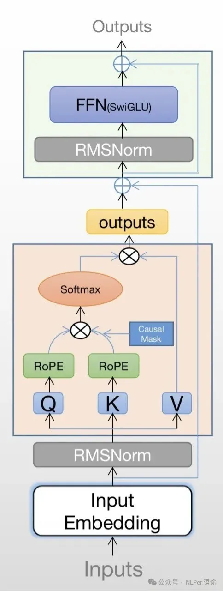
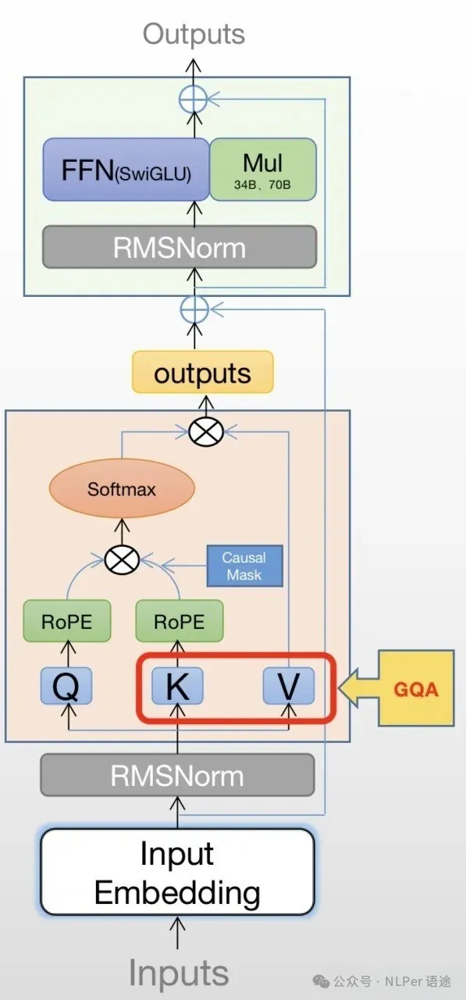

# 1. 常见模型结构 
## 1.1 Llama的结构

（参考：https://zhuanlan.zhihu.com/p/647862867）

# 1.2 LLama2结构

模型结构的变动主要是体现在GQA和FFN缩放上

MHA改成GQA：整体参数量会有减少
FFN模块矩阵维度有扩充：增强泛化能力，整体参数量增加
关于RMSNorm:

1. RMSNorM

    Norm层不再使用GPT-3中的LayerNorm，改换成RMSNorm，好处是不用计算样本的均值，速度提升了40%。
    
    

2. Mask多头注意力机制是如何进行mask的？

    在多头注意力机制中，mask是通过在注意力权重矩阵上应用一个掩码矩阵来实现的。这个掩码矩阵是一个二维矩阵，其形状与注意力权重矩阵相同，通常由0和负无穷大（或一个非常大的负数）组成。在掩码矩阵中，0值对应的位置表示允许模型关注的信息，而负无穷大值对应的位置表示模型不应该关注的信息。

    在实现时，掩码矩阵通常是通过创建一个上三角矩阵（upper triangular matrix）或根据特定任务的需求来设计的。例如，在标准的语言建模任务中，对于序列中的位置i，模型在预测位置i的输出时应该只能看到位置0到i-1的输入。因此，掩码矩阵在位置(i, j)处的值将会是：
    
    - 0，如果j <= i，表示允许模型关注。
    - -∞（或一个非常大的负数），如果j > i，表示不应该关注。
    在计算注意力分数时，掩码矩阵会与注意力权重矩阵相加（或应用其他逻辑运算），从而使得被掩码的位置的注意力分数变得非常小，在softmax函数处理后几乎为0，这样在计算注意力权重时，模型就不会考虑这些被掩码的位置。

# 参考

[1] NLP面试八股文（十二）, https://mp.weixin.qq.com/s/Zp3YJ9YA4VfGr9oj0t8PGw