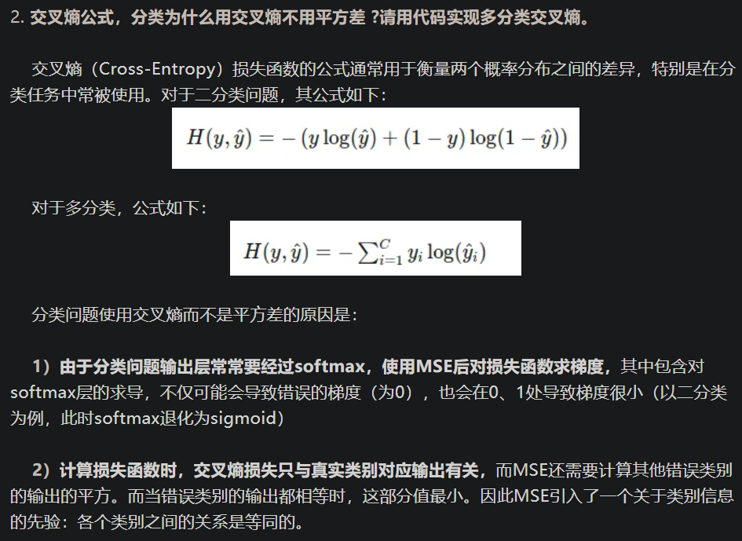
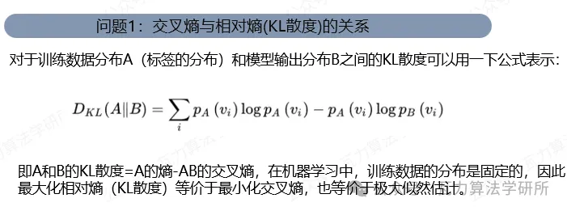
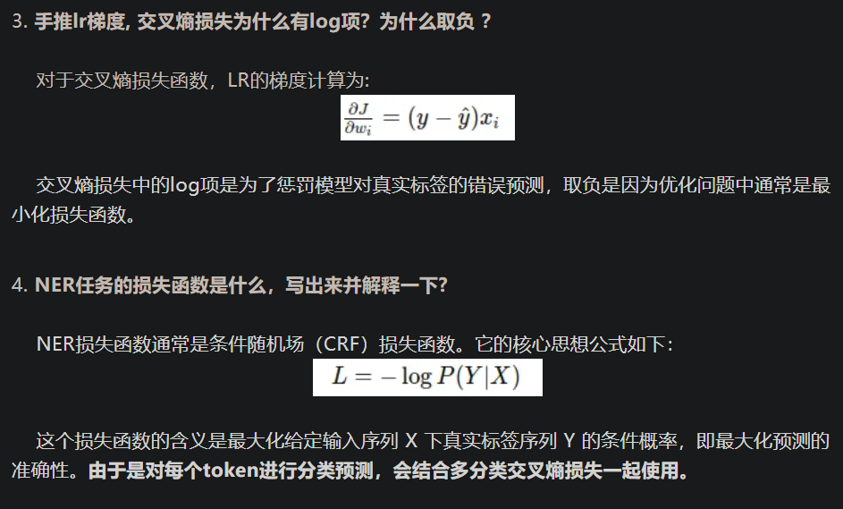

交叉熵代码

```python
import numpy as np

def cross_entropy_loss(y, y_hat):
    """

    参数：
    y : 实际标签，
    y_hat : 模型预测概率

    返回值：
    loss : 交叉熵损失
    """
    epsilon = 1e-10
    # 计算交叉熵损失
    loss = -np.sum(y * np.log(y_hat + epsilon)) / len(y)
    return loss

y_true = np.array([[1, 0, 0], [0, 1, 0], [0, 0, 1]])
y_pred = np.array([[0.9, 0.05, 0.05], [0.05, 0.89, 0.06], [0.05, 0.01, 0.94]])

# 计算交叉熵损失
loss = cross_entropy_loss(y_true, y_pred)
print("交叉熵损失：", loss)
```





为什么逻辑回归用sigmoid激活函数？多分类逻辑回归是否也是sigmoid？


sigmoid函数图像如上所示。

逻辑回归用sigmoid激活函数是因为其输出在 0 到 1 之间，可以被解释为样本属于某一类别的概率。在多分类逻辑回归中，通常会使用softmax激活函数，因为它可以将模型的输出转化为各个类别的概率分布。

# 参考

[1] AIGC算法工程师面经—公式理解篇（上）, https://mp.weixin.qq.com/s/RIKPIuYzNhCvqTLrHPA98Q
