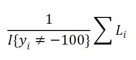

# 介绍

在LLM的训练时，由于显存不足以支撑起大batch训练，通常大家都会采用一种策略：梯度累计（gradient accumulate）。这种方法允许模型在多个batch的梯度回传累计并求均值之后，再更新一次权重。这样做相当于模拟了一个更大的批量大小，而实际上并没有一次性处理那么多数据。这样做的好处是，它可以减少内存的使用，因为不需要一次性加载所有数据到GPU上，同时也可以享受等价大batch带来的训练的稳定性和模型的泛化能力。

但是近期大家发现了一个bug：对于几乎所有使用了梯度累积策略的库，包括Huggingface的一系列库，都暗藏了一个bug，这个bug尤其在LLM的后训练阶段影响显著：使用梯度累计并不一定等价于大batch训练，会有非常明显的精度损失！

https://github.com/huggingface/trl/issues/2175

如同上述issue描述的情况，图中bs表示batch size即梯度大小, gas表示 gradient accumulate step即多少次梯度回传累计后再更新一次模型权重。

对于LLM训练而言，不像图像任务有batch norm的影响，理论上，梯度累计在应等同于全批量训练，但实际发现loss并不匹配。研究者通过公式和实验证明，罪魁祸首是开源库中使用基于平均交叉熵loss求和后进行梯度累计的实现导致了bug，这在输出等长的训练任务中并不影响（这也是为什么在CV任务和LLM预训练阶段，梯度累计没有发生明显性能损失，因为输出通常是等长的）。 梯度累积后，过度重视短输出序列的loss，而忽略长输出序列的loss。

这个bug的数学推导也非常简单：

我们首先注意到交叉熵损失的计算方法如下：

请注意，分母计算了未填充或未忽略（赋值为-100）的token的数量。首先，我们把它们设置为整个文档的平均长度，以简化我们的计算。

假设两个batch的平均序列长度不等长，一个是m1，1个是m2，对于full batch情况：

对于梯度累计情况：

明显看出在m1和m2不相等时，两者是明显不等价的。尤其是在其中一个序列长度明显更长，另一个序列长度很短时，问题更加严重：比如m1=10，m2=1000时，会发现l2的loss大小会被压缩，而l1的loss大小相对于full batch情况下会被严重放大。

这是因为不同batch的文本长度不同，导致的问题。在梯度累积中，我们需要将每个小批量梯度累积器按梯度累积步骤的数量进行缩放，以便我们得到期望的结果。

修复分母问题后重新实验：

现在确实等价了，所有的训练损失曲线都匹配上了！分母就是罪魁祸首！这意味着简单地对每个梯度累积步骤进行平均是错误的，相反，我们必须事先推导出分母。

目前，这个bug已经引起了广泛关注，不少开源库包括huggingface系列正在针对这个问题进行修复。如果近期遇到SFT效果不佳的问题，可以关注是否踩到了这个坑，短期不要使用梯度累计，或在修复后及时更新，使用新版梯度累计算法。

# 参考

[1] 大模型SFT暗藏大陷阱？梯度累计bug造成大范围影响, https://mp.weixin.qq.com/s/Za62RV9BDrbuoMERzodCUA