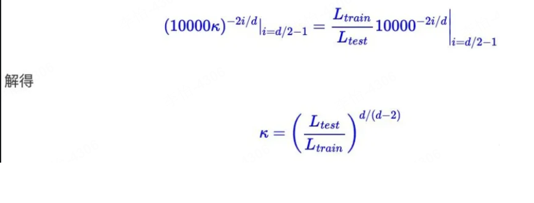

# 声明

其中，回答部分来自GPT4o, 人工做了审核，仅供参考。

# 1. ROPE编码的基本原理

ROPE（旋转位置编码）的原理可以通俗地理解为：它通过“旋转”向量的某些维度，来表示位置信息。

具体来说，**它不像传统的位置编码那样直接加到输入向量上，而是把向量的每一对相邻维度当作一个平面，按特定角度进行旋转**。这个角度和单词的位置有关——位置越靠后，旋转角度越大。

- **为什么要旋转？**  
  因为旋转具有平移不变性，也就是说向量经过旋转后，它们之间的相对关系（如点积）不会因为位置变化而丢失。这使得模型在捕捉长序列关系时更稳定。

- **简单比喻**：  
  想象把每一对维度看成一个时钟上的指针，不同位置的单词会让这个指针旋转不同的角度。这样，模型通过这些“旋转过的时钟指针”就能知道单词的位置信息，同时保持向量的结构关系。

总结来说，ROPE是通过让向量的部分维度按位置旋转，来巧妙地引入位置信息，既简单高效，又能让模型更好地理解和处理长文本的关系。

# 2. 相比绝对和相对位置编码的差异和优点

ROPE（旋转位置编码）相比传统的**绝对位置编码**和**相对位置编码**，有一些独特的差异和优势，通俗地总结如下：

---

## 2.1 **绝对位置编码**  
- **原理**：  
  每个单词的位置用一个固定的向量表示，这个位置向量直接加到输入向量上，让模型知道每个单词的位置。  
- **特点**：  
  - 每个位置的编码都是唯一的、固定的。  
  - 无法捕捉单词之间的相对位置信息。  
  - 对于长序列，编码可能不太灵活，效果会变差。  
- **比喻**：  
  像给每个座位都贴了一个固定的编号（1号、2号、3号……），告诉你单词在哪个座位上，但只关注**绝对位置**。

---

## 2.2 **相对位置编码**  
- **原理**：  
  模型关注的是单词之间的“相对距离”而非绝对位置，比如两个单词相隔了几个位置，而不是它们分别在哪个位置。  
- **特点**：  
  - 更适合捕捉局部关系，比如词与词之间的相对顺序和距离。  
  - 能处理不同长度的序列，但实现较复杂。  
- **比喻**：  
  就像你关心“前后座位之间的距离”，而不是具体的座位编号，比如“前面的人离我2个座位”。

---

## 2.3 **ROPE（旋转位置编码）**  
- **原理**：  
  ROPE通过**旋转向量的部分维度**来引入位置信息。每个单词的位置决定了旋转角度，位置越靠后，旋转的角度越大。这种旋转使得位置信息以一种平滑且连续的方式编码到向量里。  
- **特点和优势**：  
  - **更平滑、更自然**：向量通过旋转，不会破坏原有的关系，比如点积（相似度）不会受位置信息影响。  
  - **长序列表现更好**：ROPE天然适合长文本，因为它不需要固定的编码向量，可以灵活旋转。  
  - **计算简单高效**：实现过程中，只需对向量做一些简单的数学运算（旋转），不需要复杂的相对位置信息矩阵。  
- **比喻**：  
  想象单词的向量像一个时钟的指针，每个位置让指针旋转一定角度。即使指针被旋转，两个单词之间的“相对关系”依然保留。

---

## 2.4 总结对比：
| **编码方法**       | **关注点**       | **优势**                             | **局限**                       |
|-----------------|----------------|---------------------------------|-----------------------------|
| 绝对位置编码       | 单词的固定位置     | 简单直观，容易实现                     | 不能捕捉相对位置，长序列效果较差         |
| 相对位置编码       | 单词之间的相对距离   | 能处理不同长度序列，捕捉相对位置信息         | 实现复杂，计算成本较高                 |
| **ROPE**         | 通过旋转引入位置信息 | 保留原始关系，适合长序列，计算高效、自然       | 需要模型支持这种编码方法               |

---

## 2.5 为什么ROPE更好？  
ROPE**结合了绝对和相对位置编码的优点**：  
- 像**绝对位置编码**那样高效、简单，  
- 又能像**相对位置编码**一样，保留单词之间的关系和相对位置信息。  

同时，它对**长序列**的处理非常自然和平滑，是一种更高效、实用的位置编码方式。

# 3. 和ALIBI对比

### **3.1 ROPE（Rotary Position Embedding）的参数及调整方式**

**ROPE 原理回顾：**  
ROPE 是一种旋转位置编码，通过对输入序列的向量进行**旋转变换**来引入位置信息。它的核心思想是让模型的注意力机制对**位置差异**具有自然的相对编码效果，并且能平滑地扩展到更长的序列。

---

#### **关键参数**  
- **最大长度（max_position_embeddings）**  
  控制旋转位置编码能支持的最大序列长度。默认通常是 2048，如果要处理更长的序列，例如 4096 或 8192，需要增大这个值。  
- **缩放因子（scaling factor）**  
  控制旋转角度变化的速度。  
  - 缩放因子较小：编码变化较快，适用于较短序列。  
  - 缩放因子较大：编码变化较缓，适用于长序列，避免编码信息过早衰减。  

---

#### **如何调整 ROPE 参数：**  
1. **增加最大长度**  
   - 增大 `max_position_embeddings`（如从 2048 调整到 8192）。  
   - 需要重新训练或微调模型，使其适应新的位置编码范围。  

2. **调整旋转角度的缩放因子**  
   - 在实现中，旋转角度通常是通过公式：  
     \[
     \theta_i = 10000^{-2i/d}
     \]  
     其中 \(d\) 是模型的隐藏维度，\(i\) 是位置索引。  
   - 增加缩放因子的效果：  
     - 让编码的角度衰减得更慢，使模型能够适配更长的位置范围。  
     - 对于较长序列，可以通过插值（Interpolate）扩展旋转角度，平滑地支持更大的位置索引。

3. **插值扩展**  
   - 如果想快速支持更长的序列，可以对位置编码进行**插值扩展**，而不重新训练：  
     - 例如，将位置编码的角度值重新计算以适配更长的范围，而不改变编码的整体结构。  
     - 这种方式可以让已训练好的模型扩展其上下文窗口。

---

### **3.2 ALiBi（Attention Linear Bias）的原理和特点**

#### **ALiBi 原理**  
- ALiBi 是另一种位置编码方法，它通过在**注意力分数**上添加线性位置偏置（bias）来引入位置信息。  
- 具体地，ALiBi 的注意力权重 \(A_{ij}\) 被调整为：  
  \[
  A_{ij} = Q_i \cdot K_j + m \cdot |i - j|
  \]  
  其中：  
  - \(Q_i\) 和 \(K_j\) 是查询和键的表示。  
  - \(|i - j|\) 是位置 \(i\) 和位置 \(j\) 的距离。  
  - \(m\) 是一个负数偏置系数，使得注意力随着位置距离的增大而自然衰减。  

---

#### **ALiBi 的主要特点：**  
1. **线性衰减**  
   - 注意力权重会随着位置距离的增大呈线性衰减。  
   - 这种机制无需显式地引入位置编码向量，计算更高效。  

2. **无限扩展**  
   - ALiBi 不依赖于位置编码向量的维度，可以天然支持无限长的序列。  
   - **无需重新训练**，直接将 ALiBi 扩展到更长的序列范围。  

3. **更高效率**  
   - ALiBi 的位置偏置是计算注意力时的简单加法，对模型的性能影响很小，特别适合长序列场景。  

---

### **3.3 ROPE 和 ALiBi 的关系及对比**

| **对比项**             | **ROPE（旋转位置编码）**                                 | **ALiBi（线性偏置）**                            |
|-----------------------|----------------------------------------------------|----------------------------------------------|
| **编码方式**           | 通过旋转变换引入位置信息                            | 通过注意力权重加位置偏置来引入位置信息               |
| **计算效率**           | 需要计算旋转变换，对输入维度有一定开销                   | 简单加法，高效且快速                               |
| **长序列支持**         | 可通过调整旋转角度或插值支持长序列，但需微调或训练       | 天然支持长序列，无需微调或重新训练                     |
| **衰减方式**           | 通过角度变化引入位置信息，衰减是**非线性**的                | 线性衰减，位置越远注意力权重越小                       |
| **依赖隐藏维度**       | 旋转角度与隐藏维度相关                                  | 不依赖于隐藏维度                                   |
| **实现复杂度**         | 需要额外计算位置编码                                   | 简单易实现                                        |

---

### **3.4 总结：如何选择 ROPE 和 ALiBi？**  
- **选择 ROPE**  
  - 如果需要在已有的 Transformer 架构上进行小改动。  
  - 需要相对复杂的位置编码，具有非线性衰减特性。  
  - 适合对长序列做插值扩展的场景，但需要模型微调。  

- **选择 ALiBi**  
  - 如果需要高效支持长序列，且不想重新训练模型。  
  - 适合长序列处理的场景，注意力分数自然线性衰减，扩展性好。  
  - 对于极长文本或计算资源受限的情况下，ALiBi 是更优解。  

---

### **3.5 如何具体调整？**  
- **ROPE**  
   - 增大 `max_position_embeddings`。  
   - 调整缩放因子，优化旋转角度的范围。  
   - 如果扩展到更长序列，可以使用**插值方法**，无需完全重训。  

- **ALiBi**  
   - 直接启用 ALiBi 机制，位置偏置会自动线性扩展，无需微调。  
   - 可以通过调整衰减系数 \(m\) 来控制注意力的衰减速度。  

# 4. 超长序列训练中的位置编码策略
## 4.1 位置内插(Position Interpolation)：

如果在训练过程中：

训练集的长度是L:[1,2,3,4,5,6,...L]

预测的时候长度是4L：[1,2,3,4,...L,L+1,....4L]

那么因为L+1的位置没有被训练过，所以导致出现OOD情况，表现不好。

那么我们可以将所有的位置，都缩小4倍，缩小到训练过的范围内：

[1/4,2/4,3/4,1,...L/4,(L+1)/4,...L]

那么其就可以避免超过L的位置编码的OOD问题。

但是：尽管位置内插避免了远处的位置越界问题，因为它会阻止神经网络区分非常接近的token的顺序和位置，严重扰乱了模型的局部分辨率,导致其效果不行。

注意：

1.因为这种破坏，这种方法免训练外推的效果仍然很差。

2.但是在位置内插的基础上，在训练一段长文本，可以比什么都不做直接在长文本上训练，收敛更快。

## 4.2 NTK-Aware ：（RoPE-ABF（Adjusted Base Frequency）

作者认为：对位置编码的所有维度只进行简单的内插（除一个常数），丢失重要的高频细节，而网络需要这些细节来解析非常相似且非常接近的标记。因此，它提出一种非线性内插。

作者根据NTK理论：需要进行“高频外推（对高频变动小，让其保持原本不变）、低频内插（对低频变动大，让其内插）”。

高频和低频的定义：

高频：是RoPe的位置向量，i比较小(也就是前面的维度)，  较大的时候，周期短，频率高。

低频: 是RoPe的位置向量，i比较小(也就是后面的维度)，较小的时候，周期长，频率低。

作者对这个理论拿时钟做了一些解释：

RoPE 的行为就像一个时钟。您的 12 小时挂钟基本上是一个 3 维 RoPE，基数为 60。

每秒钟，每分钟，每时钟是不同的频率在旋转。（频率从高到低）

现在你的时钟一天最大能表达：606012=43200s。

你希望你的时钟表达的时间变长。

那么对于内插PI：如果我们将每秒，分钟，时钟的频率平等的缩小n倍（周期变长），可以实现这个目标。但是这导致你自己真的很难区分每一秒，因为现在秒针几乎每秒都不动。

而NTK-aware认为：我们应该对频率高的秒钟，不做缩放，而但它会将分钟减慢 1.5 倍，将小时减慢 2 倍。您可以在一小时内容纳 90 分钟，在半天内容纳 24 小时。

现在时钟可以表达：60*(601.5)(2*12)=129600.0。

我们只关注整体的时间：那么不需要精确测量时针，所以与秒相比，将小时缩放得更多是至关重要的。你不想失去秒针的精度，但你可以承受分针甚至时针的精度损失。

为了实现这个高频外推，低频内插思想，他选择修改base，

他让旋转位置编码最后一个维度（i=d/2-1）的编码，等效于内插：对位置缩小Ltrain / Ltest 倍。也就是下面的公式:

最简单的NTK-aware是增大base，比如qwen2(在预训练阶段，对于长文本的预训练，长度增加，4,096 tokens to 32,768 tokens，把base从10000增大到1,000,000，增大了100倍。

## 4.3 超长训练需要做的优化

要增大大型语言模型（LLM）对**长序列**的支持，需要从多个方面进行调整，涉及**位置编码机制**、**模型参数**以及**训练数据**。以下是通俗易懂的方案总结：

---

### 4.1 **位置编码调整**
#### **a. 使用更适合长序列的编码：**  
   - **ROPE（旋转位置编码）**：天然支持长序列，可以通过调整旋转的角度范围让它适应更长的输入序列。  
     **调整参数**：  
     - 增大**旋转角度范围**（比如通过缩放因子来降低编码在长位置的衰减效果）。  
     - 调整最大支持的长度（通过增加编码中所能表示的位置范围）。  
   - **ALiBi（Attention Linear Bias）**：引入位置偏置，使得注意力随距离逐渐衰减，适配长文本且计算高效。  

#### **b. 扩展绝对/相对位置编码：**  
   - 如果使用传统的绝对位置编码，可以通过**增加编码的最大位置范围**（如 `max_position_embeddings` 参数）来支持长序列。  
   - 对于**相对位置编码**，适当修改相对位置的可视范围。

---

### 4.2 **模型结构调整**
#### **a. 增大注意力机制的感知范围**  
   - 传统的**自注意力机制（Self-Attention）**在长序列上计算复杂度较高，可以替换为更高效的机制：  
     - **Sparse Attention（稀疏注意力）**：只关注关键位置，而不是全局所有位置。  
     - **Sliding Window Attention（滑动窗口注意力）**：在一个固定窗口内计算注意力，适合长序列。  
     - **Linear Attention（线性注意力）**：将计算复杂度从 \( O(n^2) \) 降到 \( O(n) \)，适配长文本。  

#### **b. 扩大模型的隐藏层与头数**  
   - **增加模型的隐藏层大小（hidden_size）**：让模型能更好地捕获长序列中的信息。  
   - **增加注意力头数（num_attention_heads）**：每个头可以关注不同部分的内容，有助于长序列信息的建模。

---

### 4.3 **扩展最大输入长度**
   - 在模型配置文件中**增大 `max_position_embeddings` 参数**。  
     - 比如从 1024 调整为 4096 或更大，这样模型就能处理更长的输入。  
   - 注意：增大最大长度后，需要重新训练或微调模型，否则效果可能下降。

---

### 4.4 **优化训练数据**
   - 在预训练阶段**增加长序列数据**的比例，帮助模型适应长文本。  
   - 使用**拼接过短的样本**来构建长序列数据，确保训练时的输入序列长度接近最大长度。  
   - 对于超长文本，进行**截断**和**滑动窗口分块**，将超长序列拆分成模型能处理的块，但尽量保留上下文连续性。

---

### 4.5 **分层处理长序列：Chunking机制**
   - 对于超长序列，采用**分块（chunking）机制**，将输入序列分成多个较小的块进行处理：  
     - 每个块独立计算注意力，最后再通过某种机制（如层次化建模）整合结果。  
   - 如 **Transformer-XL** 和 **Longformer** 这样的模型在此方面有较好的实现。

---

### 4.6 **使用更适合长序列的模型变体**
   如果调整参数仍然无法满足需求，可以直接选择专为长序列设计的模型架构：  
   - **Longformer**：结合了滑动窗口注意力，能高效处理长文本。  
   - **Transformer-XL**：引入了记忆机制，跨块保留长距离上下文信息。  
   - **BigBird**：稀疏注意力+全局注意力，处理长序列效率高且准确率好。  
   - **GPT-4-like 模型**：通过优化位置编码和注意力机制来支持更长的上下文。

---

### 4.7 **增大训练和推理时的上下文窗口**
   - 在训练和推理时，将批次输入的上下文窗口设置为更大值。  
     - 推理时可以适当增大 `context_window`，让模型一次性处理更长的输入。

---

### 4.8 总结  
要增大 LLM 对长序列的支持，可以通过以下手段：  
1. **位置编码**：使用 ROPE、ALiBi 等适配长文本的编码方案。  
2. **模型结构**：优化注意力机制，增大隐藏层和注意力头数。  
3. **参数调整**：增加 `max_position_embeddings`。  
4. **数据优化**：增加长文本训练样本。  
5. **选择更适合的模型变体**：如 Longformer、BigBird 等。  

这些方法可以结合使用，具体调整策略需根据应用场景和硬件资源进行权衡。

# 参考

[1] 无痛理解旋转位置编码RoPE，https://mp.weixin.qq.com/s/BKFZcEaSjrE4t2fnMPbPNQ
