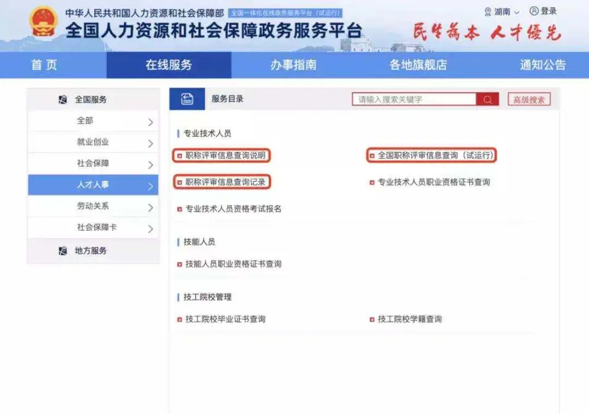
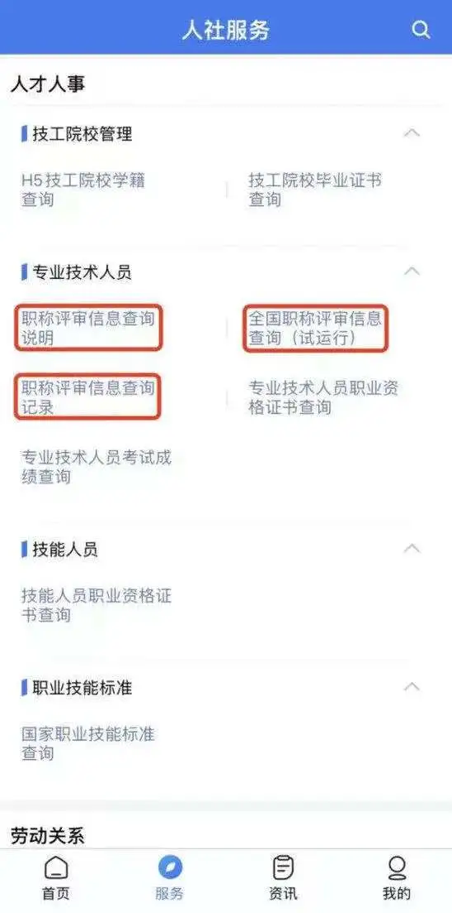

# 介绍

日前，人力资源社会保障部开通全国职称评审信息查询平台（以下简称职称查询平台），面向各地人社部门、用人单位及个人提供跨地区职称信息核验查询服务。

职称查询平台是贯彻落实中央关于深化职称制度改革部署的重要内容，是进一步优化营商环境更好服务市场主体、实现政务服务一网通办的具体举措，对实现职称评审信息共享、加强职称评审工作信息化建设、提升职称工作管理服务水平具有重要意义。

用户可通过www.12333.gov.cn网页、手机12333客户端、人力资源社会保障部门户网站、“人力资源和社会保障部”微信公众号等多种渠道登录职称查询平台。

目前，职称查询平台已收录了各地和各有关部门上报的超过1200万条职称信息，通过职称查询平台可以核验职称证书，有效挤压虚假职称证书生存空间，为专业技术人才跨地区流动提供便利服务。

今后，人力资源社会保障部还将根据各职称评审机构归集信息情况，动态更新职称评审信息，分批次扩大查询范围。

# 查询渠道

访问 www.12333.gov.cn 网页

进入“在线服务”的“人才人事”板块

使用职称查询平台

登录手机12333客户端

使用职称查询平台

# 参考

[1] 实用！职称评审信息在哪儿查？来这个平台！