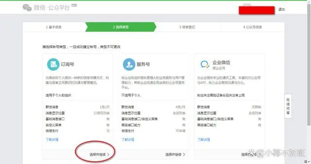

# 一、了解公众号类型
公众号主要分为订阅号、服务号和企业微信三种。订阅号主要用于信息传播，每天可以群发一条消息；服务号则侧重于功能服务，每周可以群发一条消息，具有更多的高级接口；企业微信则适用于企业内部沟通与管理。

# 二、注册公众号操作步骤

登录：https://mp.weixin.qq.com/cgi-bin/home?t=home/index&lang=zh_CN&token=1089649252

注意事项：
- 由于公众号和微信是两个提示，不能用微信号直接登录，需要重新注册一个账号。
- 另外，不能使用微信号关联的邮箱注册，否则会提示“该邮箱已被微信号关联”。

# 参考

[1] 公众号怎么开通？如何申请微信公众号，详细步骤有手就会！https://baijiahao.baidu.com/s?id=1784742535079991273