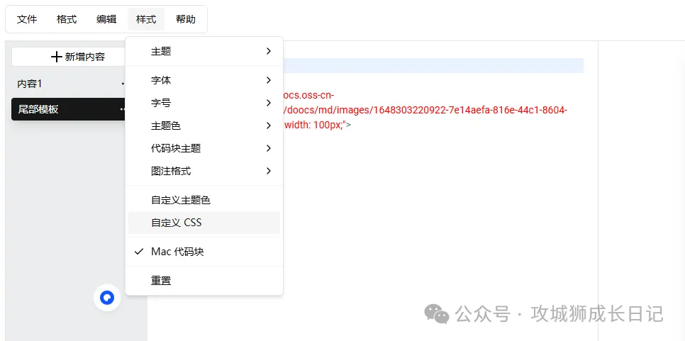
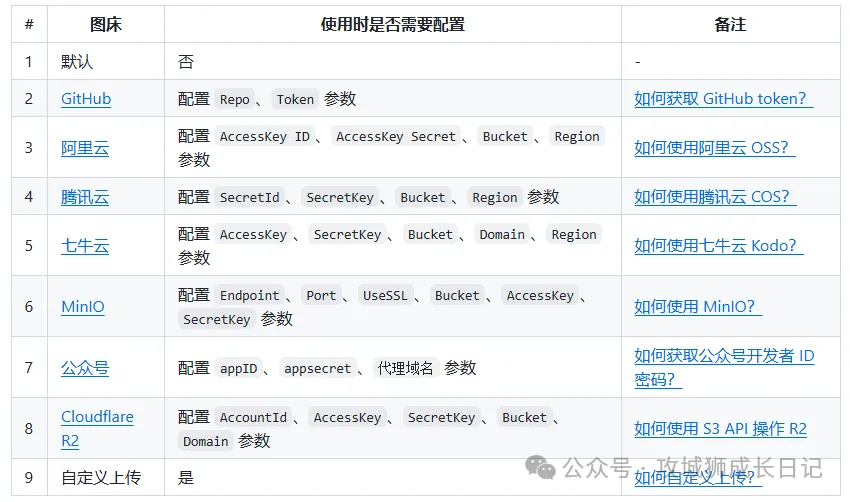

# 1. 资源

Github (7.6k stars):  doocs/md: https://github.com/doocs/md

在线编辑器地址

- https://doocs.github.io/md
- https://doocs-md.pages.dev

注：推荐使用 Chrome 浏览器，效果最佳。

# 2. 简介

WeChat Markdown Editor来帮你！一款专为微信公众号量身定制的编辑神器，让你的创作过程轻松又高效。

它不仅支持常用的Markdown语法，让你轻松实现文字的格式化，还贴心支持一键插入图片、链接，甚至表情符号，操作简单到像写日记一样轻松。更棒的是，它能直接生成微信公众号要求的格式，告别繁琐的调整和修改。

- Markdown语法支持： WeChat Markdown Editor支持常见的Markdown元素，包括标题、列表、引用、链接、图片、代码块等，让文章排版更为简洁清晰。你只需输入简单的标记语法，即可快速实现文章的格式化，提升内容的可读性和专业感。
- 自定义CSS样式：为了满足个性化需求，WeChat Markdown Editor允许用户自定义CSS样式。用户可以自由调整文章的布局、字体、颜色等细节，确保文章在微信中呈现出独特且专业的视觉效果。
- 一键重置功能：想要清空当前编辑内容？WeChat Markdown Editor 提供了一键重置功能，帮助用户快速清理编辑器内容，方便开启新的编辑任务。再也不用手动删除内容，切换工作流更高效。
-  支持多种图床：WeChat Markdown Editor 不仅支持直接上传图片，还提供了强大的图床管理功能。用户可以自由选择不同的图床进行图片存储，包括但不限于常见的第三方图床服务（如七牛云、阿里云OSS、腾讯云COS、Imgur等），甚至可以自定义图床，选择自己搭建的服务器进行上传。这一功能使得用户在编辑过程中更加灵活

# 参考

[1] 告别平淡无奇：用Markdown让你的公众号文章瞬间吸粉无数！https://mp.weixin.qq.com/s/s5k3qZV6VWnLa269Hmq2uA